# 📋 AvtoTester.uz — Biznes Talablar Rejasi (BRP)

> **Loyiha:** AvtoTester.uz  
> **Versiya:** 1.0.0  
> **Sana:** 2026-02-25  
> **Muallif:** Islomiddin Egamov  
> **Holat:** Production (Ishlab turgan)

---

## 📑 Mundarija

1. [Loyiha haqida umumiy ma'lumot](#1-loyiha-haqida-umumiy-malumot)
2. [Maqsad va vazifalar](#2-maqsad-va-vazifalar)
3. [Foydalanuvchi turlari va rollari](#3-foydalanuvchi-turlari-va-rollari)
4. [Tizim arxitekturasi](#4-tizim-arxitekturasi)
5. [Ma'lumotlar bazasi modeli](#5-malumotlar-bazasi-modeli)
6. [Funksional talablar](#6-funksional-talablar)
7. [API endpointlar](#7-api-endpointlar)
8. [Autentifikatsiya va xavfsizlik](#8-autentifikatsiya-va-xavfsizlik)
9. [Algoritmlar va biznes logikasi](#9-algoritmlar-va-biznes-logikasi)
10. [Frontend sahifalar](#10-frontend-sahifalar)
11. [Admin panel](#11-admin-panel)
12. [Telegram Bot](#12-telegram-bot)
13. [Deployment arxitekturasi](#13-deployment-arxitekturasi)
14. [Texnologiyalar steki](#14-texnologiyalar-steki)
15. [Nofunksional talablar](#15-nofunksional-talablar)

---

## 1. Loyiha haqida umumiy ma'lumot

**AvtoTester.uz** — O'zbekiston Respublikasida haydovchilik guvohnomasi olish uchun imtihonga tayyorlanish platformasi. Platforma veb-ilova, REST API backend va Telegram bot orqali foydalanuvchilarga xizmat ko'rsatadi.

### Asosiy xususiyatlar

| # | Xususiyat | Tavsif |
|---|-----------|--------|
| 1 | 📚 Mavzu bo'yicha test | YHQ qoidalarini mavzular bo'yicha o'rganish |
| 2 | 🎫 Bilet bo'yicha test | Rasmiy imtihon biletlari asosida mashq |
| 3 | 📝 SetTest | Tasodifiy tanlangan testlar bilan mashq |
| 4 | 🎓 Imtihon rejimi | Haqiqiy imtihon sharoitlarini simulyatsiya (20 savol, 20 daqiqa) |
| 5 | 📊 Statistika | Shaxsiy natijalar va taraqqiyotni kuzatish |
| 6 | 👨‍💼 Admin panel | To'liq boshqaruv paneli |
| 7 | 🤖 Telegram Bot | Telegram Mini App orqali tez kirish |

---

## 2. Maqsad va vazifalar

### 2.1 Asosiy maqsad

Foydalanuvchilarga haydovchilik guvohnomasi imtihoniga samarali tayyorlanish imkoniyatini berish.

### 2.2 Biznes vazifalari

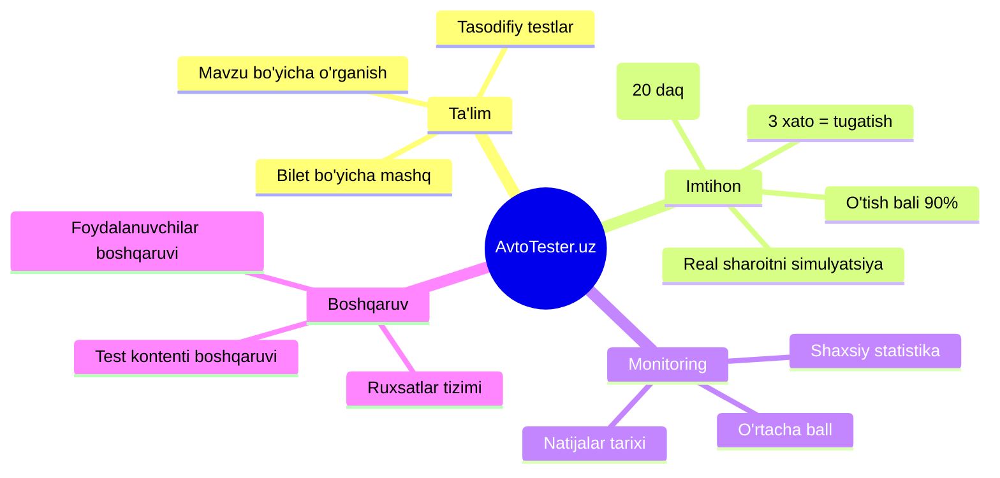
```mermaid
mindmap
  root((AvtoTester.uz))
    Ta'lim
      Mavzu bo'yicha o'rganish
      Bilet bo'yicha mashq
      Tasodifiy testlar
    Imtihon
      Real sharoitni simulyatsiya
      Vaqt cheklovi (20 daq)
      3 xato = tugatish
      O'tish bali 90%
    Monitoring
      Shaxsiy statistika
      Natijalar tarixi
      O'rtacha ball
    Boshqaruv
      Foydalanuvchilar boshqaruvi
      Test kontenti boshqaruvi
      Ruxsatlar tizimi
```

---

## 3. Foydalanuvchi turlari va rollari

### 3.1 Rollar diagrammasi

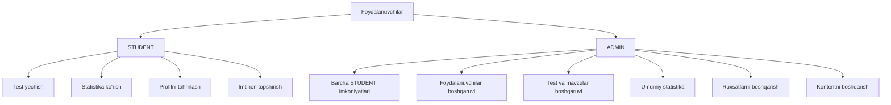
```mermaid
graph TD
    A[Foydalanuvchilar] --> B[STUDENT]
    A --> C[ADMIN]
    
    B --> B1[Test yechish]
    B --> B2[Statistika ko'rish]
    B --> B3[Profilni tahrirlash]
    B --> B4[Imtihon topshirish]
    
    C --> C1[Barcha STUDENT imkoniyatlari]
    C --> C2[Foydalanuvchilar boshqaruvi]
    C --> C3[Test va mavzular boshqaruvi]
    C --> C4[Umumiy statistika]
    C --> C5[Ruxsatlarni boshqarish]
    C --> C6[Kontentni boshqarish]
```

### 3.2 Rollar tavsifi

| Rol | Enum | Tavsif | Ruxsatlar |
|-----|------|--------|-----------|
| **Talaba** | `STUDENT` | Oddiy foydalanuvchi | Test yechish, statistika ko'rish, profil tahrirlash |
| **Admin** | `ADMIN` | Tizim boshqaruvchisi | Barcha CRUD operatsiyalari, foydalanuvchi boshqaruvi |

### 3.3 Maxsus ruxsatlar

| Ruxsat | Maydon | Tavsif |
|--------|--------|--------|
| **Imtihon ruxsati** | `ruxsat` (boolean) | Admin tomonidan beriladi. `False` bo'lsa, imtihon rejimiga kirishga ruxsat yo'q |
| **Staff holati** | `is_staff` (boolean) | Django admin paneliga kirish huquqi |

---

## 4. Tizim arxitekturasi

### 4.1 Umumiy arxitektura diagrammasi

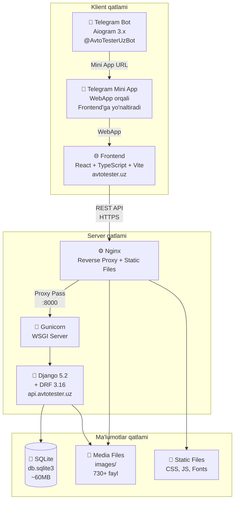
```mermaid
graph TB
    subgraph "Klient qatlami"
        FE["🌐 Frontend<br/>React + TypeScript + Vite<br/>avtotester.uz"]
        TG["🤖 Telegram Bot<br/>Aiogram 3.x<br/>@AvtoTesterUzBot"]
        MA["📱 Telegram Mini App<br/>WebApp orqali<br/>Frontend'ga yo'naltiradi"]
    end

    subgraph "Server qatlami"
        NG["⚙️ Nginx<br/>Reverse Proxy + Static Files"]
        GU["🦄 Gunicorn<br/>WSGI Server"]
        DJ["🐍 Django 5.2<br/>+ DRF 3.16<br/>api.avtotester.uz"]
    end

    subgraph "Ma'lumotlar qatlami"
        DB[("💾 SQLite<br/>db.sqlite3<br/>~60MB")]
        FS["📁 Media Files<br/>images/<br/>730+ fayl"]
        ST["📂 Static Files<br/>CSS, JS, Fonts"]
    end

    FE -->|"REST API<br/>HTTPS"| NG
    TG -->|"Mini App URL"| MA
    MA -->|"WebApp"| FE
    NG -->|"Proxy Pass<br/>:8000"| GU
    GU --> DJ
    DJ --> DB
    DJ --> FS
    NG --> ST
    NG --> FS
```

### 4.2 So'rov oqimi (Request Flow)

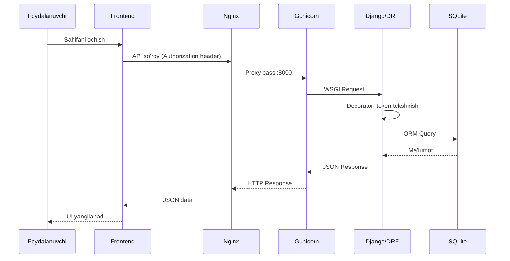
```mermaid
sequenceDiagram
    participant U as Foydalanuvchi
    participant F as Frontend
    participant N as Nginx
    participant G as Gunicorn
    participant D as Django/DRF
    participant DB as SQLite

    U->>F: Sahifani ochish
    F->>N: API so'rov (Authorization header)
    N->>G: Proxy pass :8000
    G->>D: WSGI Request
    D->>D: Decorator: token tekshirish
    D->>DB: ORM Query
    DB-->>D: Ma'lumot
    D-->>G: JSON Response
    G-->>N: HTTP Response
    N-->>F: JSON data
    F-->>U: UI yangilanadi
```

---

## 5. Ma'lumotlar bazasi modeli

### 5.1 ER Diagramma (Entity-Relationship)

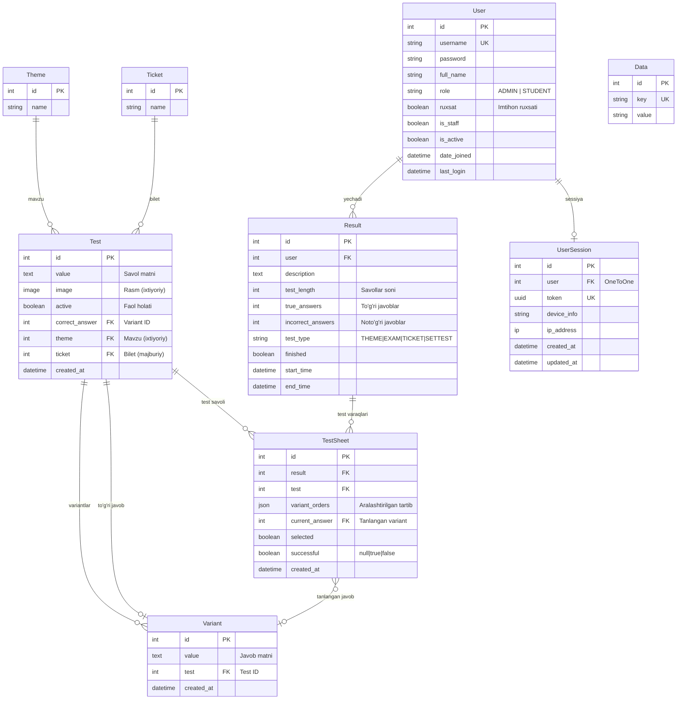
```mermaid
erDiagram
    User ||--o{ Result : "yechadi"
    User ||--o| UserSession : "sessiya"
    Theme ||--o{ Test : "mavzu"
    Ticket ||--o{ Test : "bilet"
    Test ||--o{ Variant : "variantlar"
    Test ||--o| Variant : "to'g'ri javob"
    Result ||--o{ TestSheet : "test varaqlari"
    Test ||--o{ TestSheet : "test savoli"
    TestSheet }o--o| Variant : "tanlangan javob"
    
    User {
        int id PK
        string username UK
        string password
        string full_name
        string role "ADMIN | STUDENT"
        boolean ruxsat "Imtihon ruxsati"
        boolean is_staff
        boolean is_active
        datetime date_joined
        datetime last_login
    }
    
    Theme {
        int id PK
        string name
    }
    
    Ticket {
        int id PK
        string name
    }
    
    Test {
        int id PK
        text value "Savol matni"
        image image "Rasm (ixtiyoriy)"
        boolean active "Faol holati"
        int correct_answer FK "Variant ID"
        int theme FK "Mavzu (ixtiyoriy)"
        int ticket FK "Bilet (majburiy)"
        datetime created_at
    }
    
    Variant {
        int id PK
        text value "Javob matni"
        int test FK "Test ID"
        datetime created_at
    }
    
    Result {
        int id PK
        int user FK
        text description
        int test_length "Savollar soni"
        int true_answers "To'g'ri javoblar"
        int incorrect_answers "Noto'g'ri javoblar"
        string test_type "THEME|EXAM|TICKET|SETTEST"
        boolean finished
        datetime start_time
        datetime end_time
    }
    
    TestSheet {
        int id PK
        int result FK
        int test FK
        json variant_orders "Aralashtirilgan tartib"
        int current_answer FK "Tanlangan variant"
        boolean selected
        boolean successful "null|true|false"
        datetime created_at
    }
    
    UserSession {
        int id PK
        int user FK "OneToOne"
        uuid token UK
        string device_info
        ip ip_address
        datetime created_at
        datetime updated_at
    }
    
    Data {
        int id PK
        string key UK
        string value
    }
```

### 5.2 Modellar tavsifi

| Model | Fayl | Maqsad | Muhim xususiyatlari |
|-------|------|--------|---------------------|
| **User** | `models.py:8-18` | Foydalanuvchi | `AbstractUser` dan vorislik, `role` va `ruxsat` maydonlari |
| **Theme** | `models.py:20-24` | Mavzu | Test guruhlash uchun |
| **Ticket** | `models.py:26-30` | Bilet | Rasmiy biletlar bo'yicha guruhlash |
| **Test** | `models.py:32-73` | Test savoli | Rasm bilan, avtomatik eski rasm o'chirish, `correct_answer` bo'lmasa `active=False` |
| **Variant** | `models.py:75-81` | Javob varianti | Testga bog'liq |
| **Result** | `models.py:83-100` | Natija | Test sessiyasining umumiy natijasi |
| **TestSheet** | `models.py:102-117` | Test varaqasi | Har bir savol uchun javob holati, variant tartibini saqlash |
| **UserSession** | `models.py:119-128` | Sessiya | Token-based autentifikatsiya, qurilma ma'lumoti |
| **Data** | `models.py:131-133` | Key-Value | Dinamik sozlamalar (telegram_link, phone, instagram, youtube) |

---

## 6. Funksional talablar

### 6.1 Test turlari va qoidalari

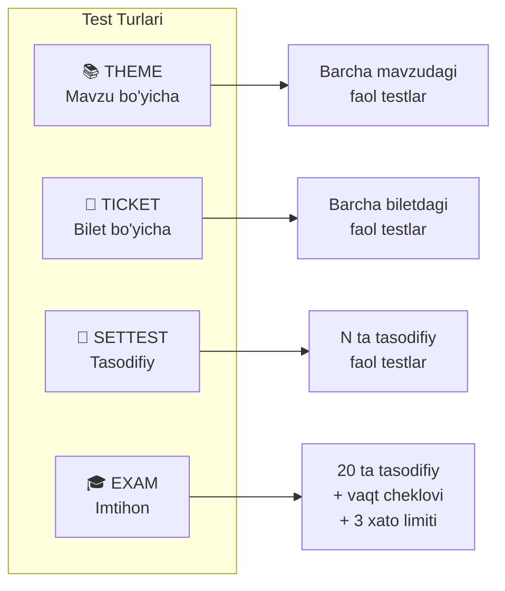
```mermaid
graph LR
    subgraph "Test Turlari"
        T1["📚 THEME<br/>Mavzu bo'yicha"]
        T2["🎫 TICKET<br/>Bilet bo'yicha"]
        T3["📝 SETTEST<br/>Tasodifiy"]
        T4["🎓 EXAM<br/>Imtihon"]
    end

    T1 --> R1["Barcha mavzudagi<br/>faol testlar"]
    T2 --> R2["Barcha biletdagi<br/>faol testlar"]
    T3 --> R3["N ta tasodifiy<br/>faol testlar"]
    T4 --> R4["20 ta tasodifiy<br/>+ vaqt cheklovi<br/>+ 3 xato limiti"]
```

### 6.2 Imtihon qoidalari

| Parametr | Qiymat | Tavsif |
|----------|--------|--------|
| ⏱️ Vaqt | 20 daqiqa | Vaqt tugagandan keyin avtomatik tugatiladi |
| 📋 Savollar | 20 ta | Tasodifiy tanlangan faol testlar |
| ✅ O'tish bali | 18/20 (90%) | Muvaffaqiyatli topshirish uchun |
| ❌ Xato limiti | 3 ta | 3 ta xatodan keyin imtihon avtomatik tugatiladi |
| 🔐 Ruxsat | `ruxsat=True` | Admin tomonidan ruxsat berilishi kerak |

### 6.3 Use Case diagrammasi

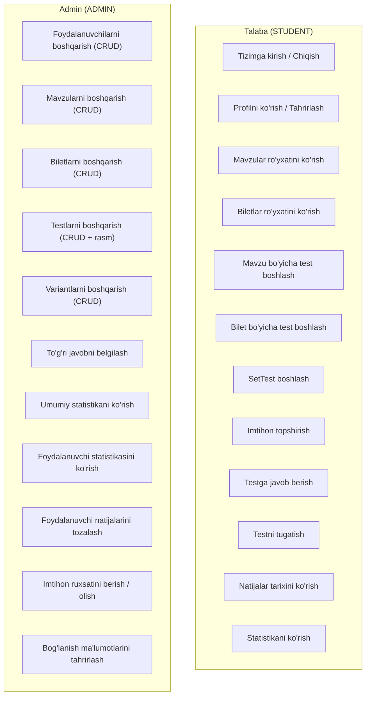
```mermaid
graph TB
    subgraph "Talaba (STUDENT)"
        UC1["Tizimga kirish / Chiqish"]
        UC2["Profilni ko'rish / Tahrirlash"]
        UC3["Mavzular ro'yxatini ko'rish"]
        UC4["Biletlar ro'yxatini ko'rish"]
        UC5["Mavzu bo'yicha test boshlash"]
        UC6["Bilet bo'yicha test boshlash"]
        UC7["SetTest boshlash"]
        UC8["Imtihon topshirish"]
        UC9["Testga javob berish"]
        UC10["Testni tugatish"]
        UC11["Natijalar tarixini ko'rish"]
        UC12["Statistikani ko'rish"]
    end

    subgraph "Admin (ADMIN)"
        UC20["Foydalanuvchilarni boshqarish (CRUD)"]
        UC21["Mavzularni boshqarish (CRUD)"]
        UC22["Biletlarni boshqarish (CRUD)"]
        UC23["Testlarni boshqarish (CRUD + rasm)"]
        UC24["Variantlarni boshqarish (CRUD)"]
        UC25["To'g'ri javobni belgilash"]
        UC26["Umumiy statistikani ko'rish"]
        UC27["Foydalanuvchi statistikasini ko'rish"]
        UC28["Foydalanuvchi natijalarini tozalash"]
        UC29["Imtihon ruxsatini berish / olish"]
        UC30["Bog'lanish ma'lumotlarini tahrirlash"]
    end
```

---

## 7. API endpointlar

### 7.1 Autentifikatsiya API

| Method | Endpoint | Tavsif | Auth |
|--------|----------|--------|------|
| `POST` | `/api/auth/login/` | Tizimga kirish | ❌ |
| `POST` | `/api/auth/logout/` | Tizimdan chiqish | ✅ User |

### 7.2 Foydalanuvchi API

| Method | Endpoint | Tavsif | Auth |
|--------|----------|--------|------|
| `GET` | `/api/profile/` | Profil ma'lumotlari | ✅ User |
| `PUT` | `/api/profile/` | Profilni yangilash | ✅ User |
| `GET` | `/api/themes/` | Mavzular ro'yxati | ✅ User |
| `GET` | `/api/tickets/` | Biletlar ro'yxati | ✅ User |
| `GET` | `/api/statistics/` | Shaxsiy statistika | ✅ User |
| `GET` | `/api/results/` | Natijalar tarixi | ✅ User |

### 7.3 Test boshlash API

| Method | Endpoint | Tavsif | Body |
|--------|----------|--------|------|
| `POST` | `/api/start_tests/start_theme/` | Mavzu bo'yicha | `{"theme_id": int}` |
| `POST` | `/api/start_tests/start_ticket/` | Bilet bo'yicha | `{"ticket_id": int}` |
| `POST` | `/api/start_tests/start_settest/` | SetTest | `{"count": int}` |
| `POST` | `/api/start_tests/start_exam/` | Imtihon | `{"count": 20}` |

### 7.4 Test yechish API

| Method | Endpoint | Tavsif | Body |
|--------|----------|--------|------|
| `GET` | `/api/result/{id}/tests/` | Test savollari va variantlari | — |
| `POST` | `/api/solve_tests/{id}/answer/` | Javob yuborish | `{"variant_id": int}` |
| `POST` | `/api/solve_tests/{id}/finish/` | Testni tugatish | — |
| `GET` | `/api/result/{id}/statistics/` | Natija statistikasi | — |

### 7.5 Admin API

| Method | Endpoint | Tavsif |
|--------|----------|--------|
| `GET/POST` | `/api/admin/user/` | Foydalanuvchilar CRUD |
| `GET/PUT/DELETE` | `/api/admin/user/{id}/` | Foydalanuvchi operatsiyalari |
| `GET/POST` | `/api/admin/theme/` | Mavzular CRUD |
| `GET/PUT/DELETE` | `/api/admin/theme/{id}/` | Mavzu operatsiyalari |
| `GET/POST` | `/api/admin/ticket/` | Biletlar CRUD |
| `GET/PUT/DELETE` | `/api/admin/ticket/{id}/` | Bilet operatsiyalari |
| `GET/POST` | `/api/admin/test/` | Testlar CRUD |
| `GET/PUT/DELETE/PATCH` | `/api/admin/test/{id}/` | Test operatsiyalari (PATCH = rasm yuklash) |
| `GET/POST` | `/api/admin/test/{test_id}/variant/` | Variantlar CRUD |
| `GET/PUT/DELETE` | `/api/admin/test/variant/{id}/` | Variant operatsiyalari |
| `POST` | `/api/admin/test/variant/{id}/true/` | To'g'ri javob belgilash |
| `GET` | `/api/admin/statistics/` | Admin statistika |
| `GET` | `/api/admin/all_users_stats/` | Barcha foydalanuvchilar statistikasi |
| `GET` | `/api/admin/user_statistics/{user_id}/` | Bitta foydalanuvchi statistikasi |

### 7.6 Public API

| Method | Endpoint | Tavsif | Auth |
|--------|----------|--------|------|
| `GET` | `/api/public/connection/` | Bog'lanish ma'lumotlari | ❌ |
| `PUT` | `/api/public/connection/` | Ma'lumotlarni yangilash | ✅ Admin |

### 7.7 API so'rov oqimi

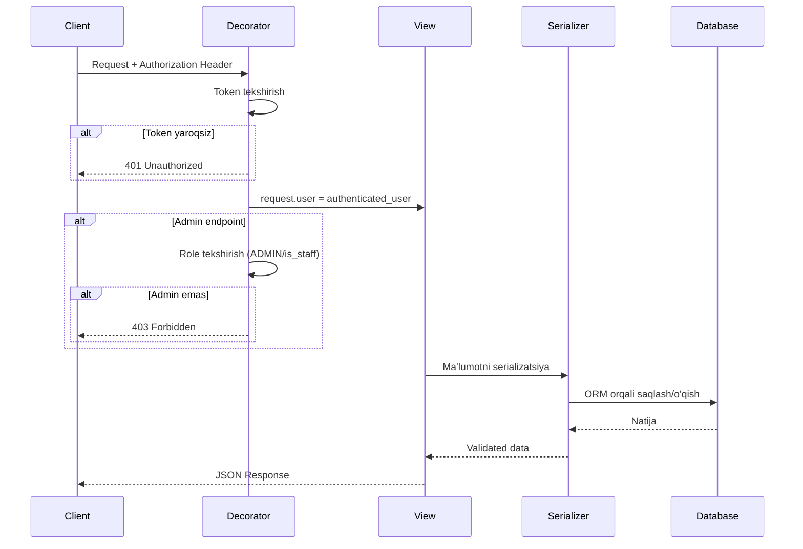
```mermaid
sequenceDiagram
    participant C as Client
    participant D as Decorator
    participant V as View
    participant S as Serializer
    participant DB as Database

    C->>D: Request + Authorization Header
    D->>D: Token tekshirish
    alt Token yaroqsiz
        D-->>C: 401 Unauthorized
    end
    D->>V: request.user = authenticated_user
    alt Admin endpoint
        D->>D: Role tekshirish (ADMIN/is_staff)
        alt Admin emas
            D-->>C: 403 Forbidden
        end
    end
    V->>S: Ma'lumotni serializatsiya
    S->>DB: ORM orqali saqlash/o'qish
    DB-->>S: Natija
    S-->>V: Validated data
    V-->>C: JSON Response
```

---

## 8. Autentifikatsiya va xavfsizlik

### 8.1 Login jarayoni algoritmi

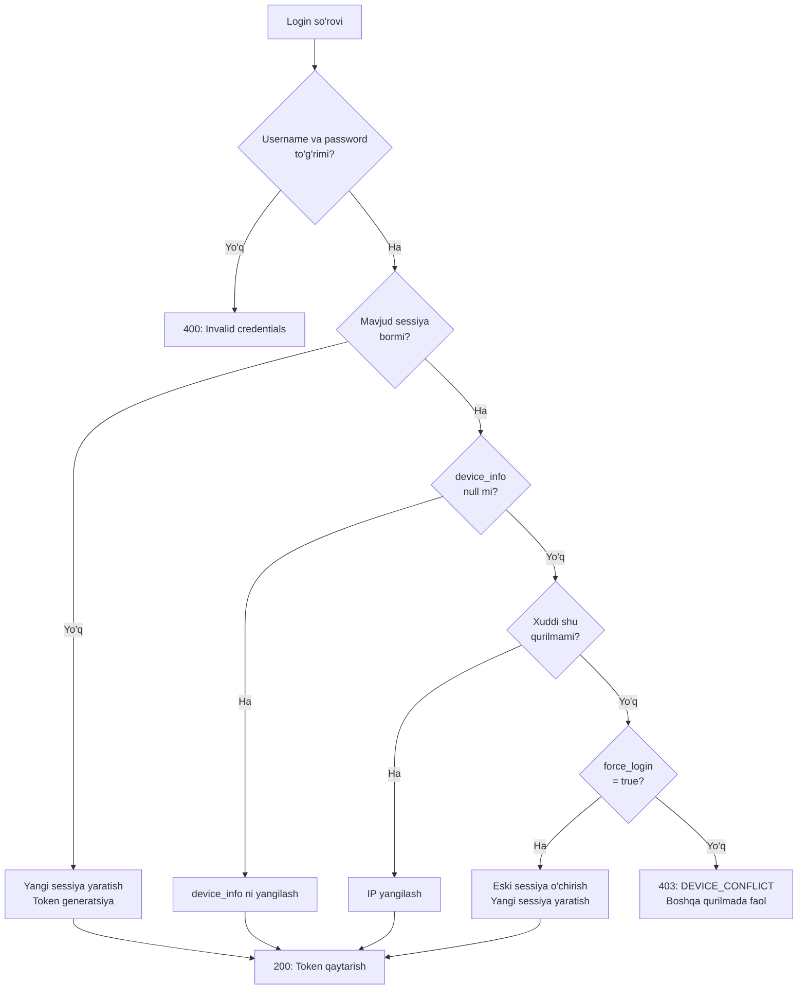
```mermaid
flowchart TD
    A[Login so'rovi] --> B{Username va password<br/>to'g'rimi?}
    B -->|Yo'q| C[400: Invalid credentials]
    B -->|Ha| D{Mavjud sessiya<br/>bormi?}
    
    D -->|Yo'q| E[Yangi sessiya yaratish<br/>Token generatsiya]
    E --> F[200: Token qaytarish]
    
    D -->|Ha| G{device_info<br/>null mi?}
    G -->|Ha| H[device_info ni yangilash]
    H --> F
    
    G -->|Yo'q| I{Xuddi shu<br/>qurilmami?}
    I -->|Ha| J[IP yangilash]
    J --> F
    
    I -->|Yo'q| K{force_login<br/>= true?}
    K -->|Ha| L[Eski sessiya o'chirish<br/>Yangi sessiya yaratish]
    L --> F
    K -->|Yo'q| M[403: DEVICE_CONFLICT<br/>Boshqa qurilmada faol]
```

### 8.2 Token autentifikatsiyasi

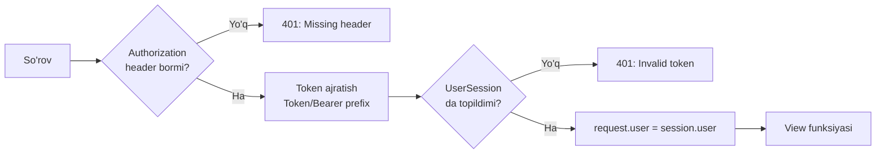
```mermaid
flowchart LR
    A[So'rov] --> B{Authorization<br/>header bormi?}
    B -->|Yo'q| C[401: Missing header]
    B -->|Ha| D[Token ajratish<br/>Token/Bearer prefix]
    D --> E{UserSession<br/>da topildimi?}
    E -->|Yo'q| F[401: Invalid token]
    E -->|Ha| G[request.user = session.user]
    G --> H[View funksiyasi]
```

### 8.3 Xavfsizlik choralari

| Chora | Amalga oshirilgan | Tavsif |
|-------|-------------------|--------|
| CORS | ✅ | Faqat ruxsat berilgan domenlar |
| CSRF | ✅ | Trusted origins ro'yxati |
| Token Auth | ✅ | UUID-based custom tokenlar |
| Device Check | ✅ | Bitta qurilmadan kirish cheklovi |
| Admin Decorator | ✅ | Role-based kirish nazorati |
| Password Hashing | ✅ | Django `set_password()` |
| File Validation | ✅ | Rasm hajmi (5MB) va format tekshirish |

---

## 9. Algoritmlar va biznes logikasi

### 9.1 Test boshlash algoritmi

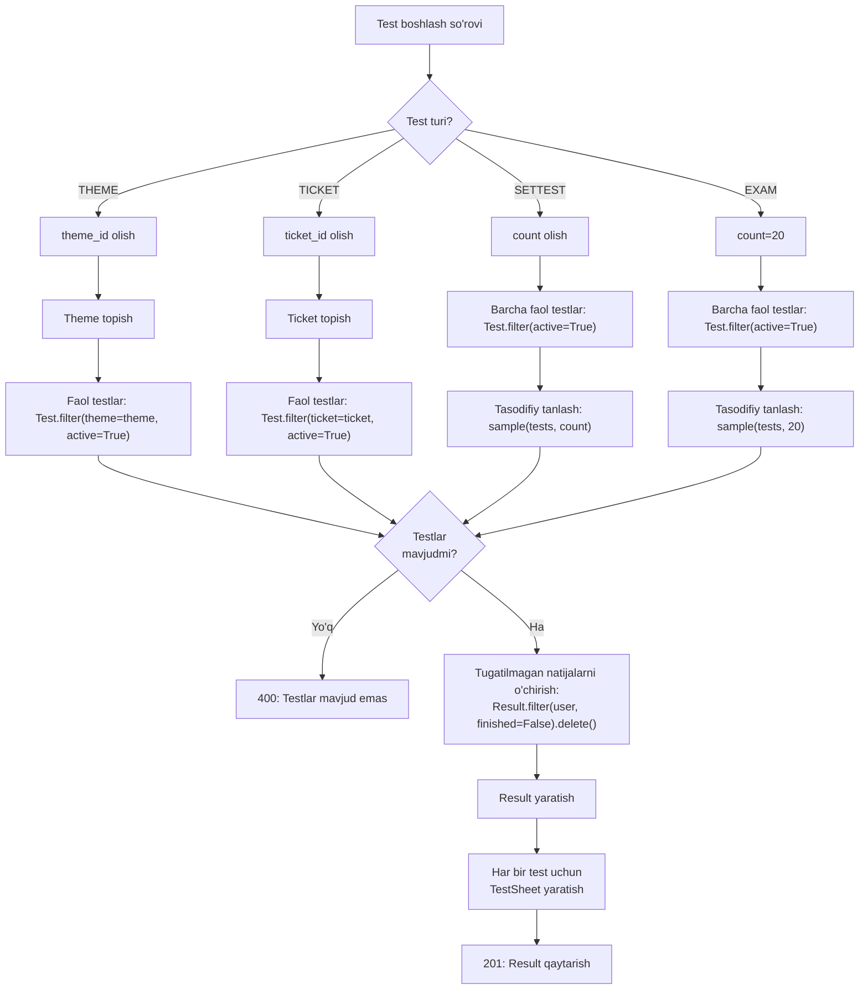
```mermaid
flowchart TD
    A[Test boshlash so'rovi] --> B{Test turi?}
    
    B -->|THEME| C[theme_id olish]
    C --> D[Theme topish]
    D --> E["Faol testlar: Test.filter(theme=theme, active=True)"]
    
    B -->|TICKET| F[ticket_id olish]
    F --> G[Ticket topish]
    G --> H["Faol testlar: Test.filter(ticket=ticket, active=True)"]
    
    B -->|SETTEST| I[count olish]
    I --> J["Barcha faol testlar: Test.filter(active=True)"]
    J --> K["Tasodifiy tanlash: sample(tests, count)"]
    
    B -->|EXAM| L[count=20]
    L --> M["Barcha faol testlar: Test.filter(active=True)"]
    M --> N["Tasodifiy tanlash: sample(tests, 20)"]
    
    E --> O{Testlar<br/>mavjudmi?}
    H --> O
    K --> O
    N --> O
    
    O -->|Yo'q| P[400: Testlar mavjud emas]
    O -->|Ha| Q["Tugatilmagan natijalarni o'chirish:<br/>Result.filter(user, finished=False).delete()"]
    Q --> R[Result yaratish]
    R --> S["Har bir test uchun<br/>TestSheet yaratish"]
    S --> T[201: Result qaytarish]
```

### 9.2 Javob berish algoritmi

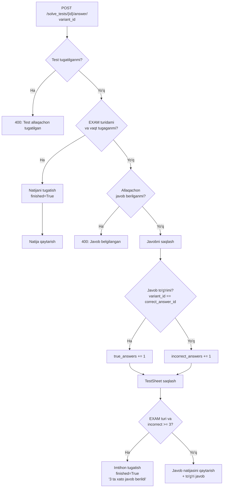
```mermaid
flowchart TD
    A["POST /solve_tests/{id}/answer/<br/>variant_id"] --> B{Test tugatilganmi?}
    B -->|Ha| C[400: Test allaqachon tugatilgan]
    
    B -->|Yo'q| D{EXAM turidami<br/>va vaqt tugaganmi?}
    D -->|Ha| E[Natijani tugatish<br/>finished=True]
    E --> F[Natija qaytarish]
    
    D -->|Yo'q| G{Allaqachon<br/>javob berilganmi?}
    G -->|Ha| H[400: Javob belgilangan]
    
    G -->|Yo'q| I[Javobni saqlash]
    I --> J{Javob to'g'rimi?<br/>variant_id == correct_answer_id}
    
    J -->|Ha| K[true_answers += 1]
    J -->|Yo'q| L[incorrect_answers += 1]
    
    K --> M[TestSheet saqlash]
    L --> M
    
    M --> N{EXAM turi va<br/>incorrect >= 3?}
    N -->|Ha| O["Imtihon tugatish<br/>finished=True<br/>'3 ta xato javob berildi'"]
    N -->|Yo'q| P[Javob natijasini qaytarish<br/>+ to'g'ri javob]
```

### 9.3 Test yaratish algoritmi (Admin)

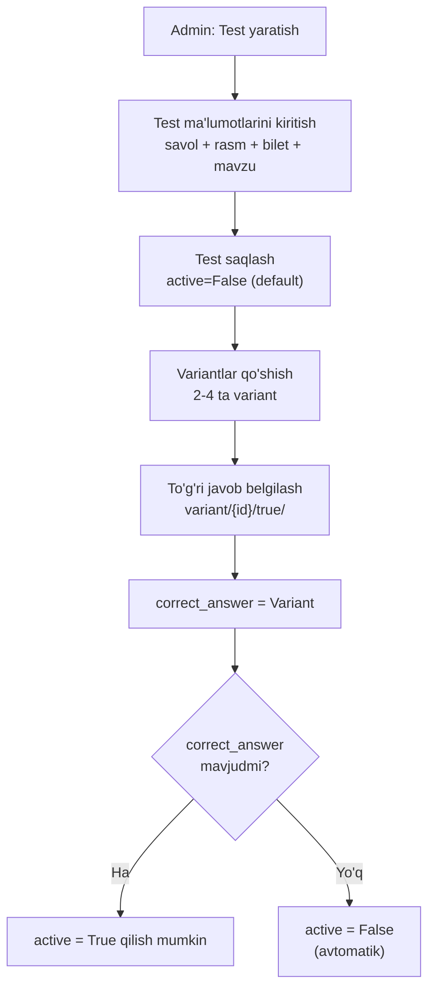
```mermaid
flowchart TD
    A[Admin: Test yaratish] --> B[Test ma'lumotlarini kiritish<br/>savol + rasm + bilet + mavzu]
    B --> C["Test saqlash<br/>active=False (default)"]
    C --> D[Variantlar qo'shish<br/>2-4 ta variant]
    D --> E["To'g'ri javob belgilash<br/>variant/{id}/true/"]
    E --> F["correct_answer = Variant"]
    F --> G{correct_answer<br/>mavjudmi?}
    G -->|Ha| H[active = True qilish mumkin]
    G -->|Yo'q| I["active = False<br/>(avtomatik)"]
```

### 9.4 Test holatlarining hayot sikli

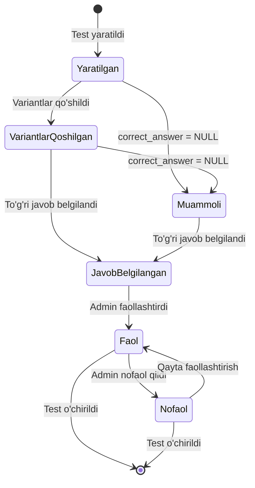
```mermaid
stateDiagram-v2
    [*] --> Yaratilgan: Test yaratildi
    Yaratilgan --> VariantlarQoshilgan: Variantlar qo'shildi
    VariantlarQoshilgan --> JavobBelgilangan: To'g'ri javob belgilandi
    JavobBelgilangan --> Faol: Admin faollashtirdi
    Faol --> Nofaol: Admin nofaol qildi
    Nofaol --> Faol: Qayta faollashtirish
    
    Yaratilgan --> Muammoli: correct_answer = NULL
    VariantlarQoshilgan --> Muammoli: correct_answer = NULL
    Muammoli --> JavobBelgilangan: To'g'ri javob belgilandi
    
    Faol --> [*]: Test o'chirildi
    Nofaol --> [*]: Test o'chirildi
```

### 9.5 Imtihon natijasi hisoblash

```
Pseudocode:

FUNCTION calculate_exam_result(result):
    all = result.test_length           // Jami savollar (20)
    trues = result.true_answers        // To'g'ri javoblar
    falses = result.incorrect_answers  // Noto'g'ri javoblar
    ignores = all - trues - falses     // Javob berilmagan
    percentage = (trues / all) * 100   // Foiz
    
    IF trues >= 18:
        status = "MUVAFFAQIYATLI" ✅
    ELSE:
        status = "MUVAFFAQIYATSIZ" ❌
    
    RETURN {all, trues, falses, ignores, percentage, status}
```

---

## 10. Frontend sahifalar

### 10.1 Sahifalar xaritasi

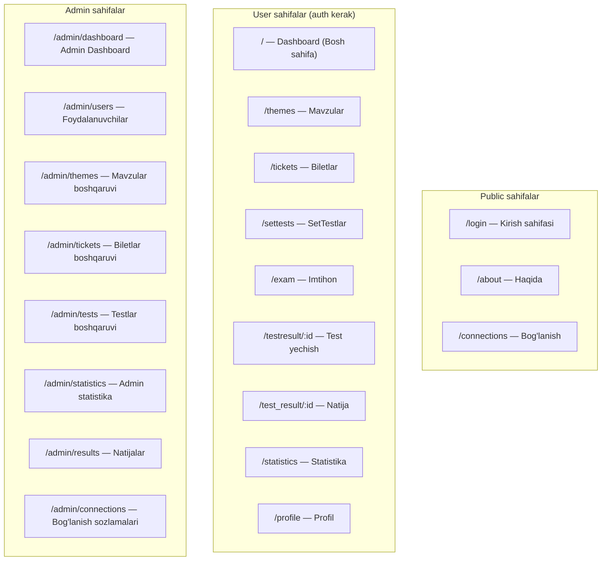
```mermaid
graph TB
    subgraph "Public sahifalar"
        P1["/login — Kirish sahifasi"]
        P2["/about — Haqida"]
        P3["/connections — Bog'lanish"]
    end

    subgraph "User sahifalar (auth kerak)"
        U1["/ — Dashboard (Bosh sahifa)"]
        U2["/themes — Mavzular"]
        U3["/tickets — Biletlar"]
        U4["/settests — SetTestlar"]
        U5["/exam — Imtihon"]
        U6["/testresult/:id — Test yechish"]
        U7["/test_result/:id — Natija"]
        U8["/statistics — Statistika"]
        U9["/profile — Profil"]
    end

    subgraph "Admin sahifalar"
        A1["/admin/dashboard — Admin Dashboard"]
        A2["/admin/users — Foydalanuvchilar"]
        A3["/admin/themes — Mavzular boshqaruvi"]
        A4["/admin/tickets — Biletlar boshqaruvi"]
        A5["/admin/tests — Testlar boshqaruvi"]
        A6["/admin/statistics — Admin statistika"]
        A7["/admin/results — Natijalar"]
        A8["/admin/connections — Bog'lanish sozlamalari"]
    end
```

### 10.2 Frontend komponentlari

| Komponent | Fayl | Maqsad |
|-----------|------|--------|
| **Layout** | `components/Layout/` | Header, Footer, umumiy tuzilma |
| **AppRoutes** | `routes/AppRoutes.tsx` | Routing va auth himoyasi |
| **Backend** | `utils/Backend.tsx` | `ServerConnection` class — API aloqasi |
| **Admin** | `utils/Admin.tsx` | Admin API yordamchi funksiyalari |
| **latinToCyrillic** | `utils/latinToCyrillic.tsx` | Lotin-kirill konvertatsiya |

### 10.3 Frontend arxitektura diagrammasi

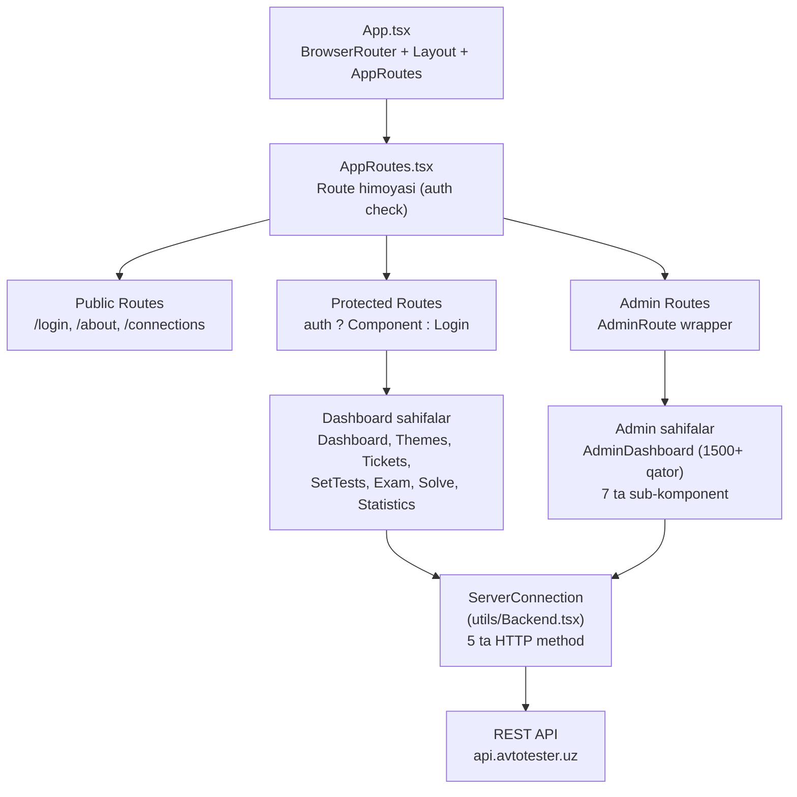
```mermaid
graph TB
    App["App.tsx<br/>BrowserRouter + Layout + AppRoutes"]
    
    App --> Routes["AppRoutes.tsx<br/>Route himoyasi (auth check)"]
    
    Routes --> Public["Public Routes<br/>/login, /about, /connections"]
    Routes --> Protected["Protected Routes<br/>auth ? Component : Login"]
    Routes --> Admin["Admin Routes<br/>AdminRoute wrapper"]
    
    Protected --> Pages["Dashboard sahifalar<br/>Dashboard, Themes, Tickets,<br/>SetTests, Exam, Solve, Statistics"]
    Admin --> AdminPages["Admin sahifalar<br/>AdminDashboard (1500+ qator)<br/>7 ta sub-komponent"]
    
    Pages --> ServerConn["ServerConnection<br/>(utils/Backend.tsx)<br/>5 ta HTTP method"]
    AdminPages --> ServerConn
    
    ServerConn --> API["REST API<br/>api.avtotester.uz"]
```

---

## 11. Admin panel

### 11.1 Admin panel tuzilishi

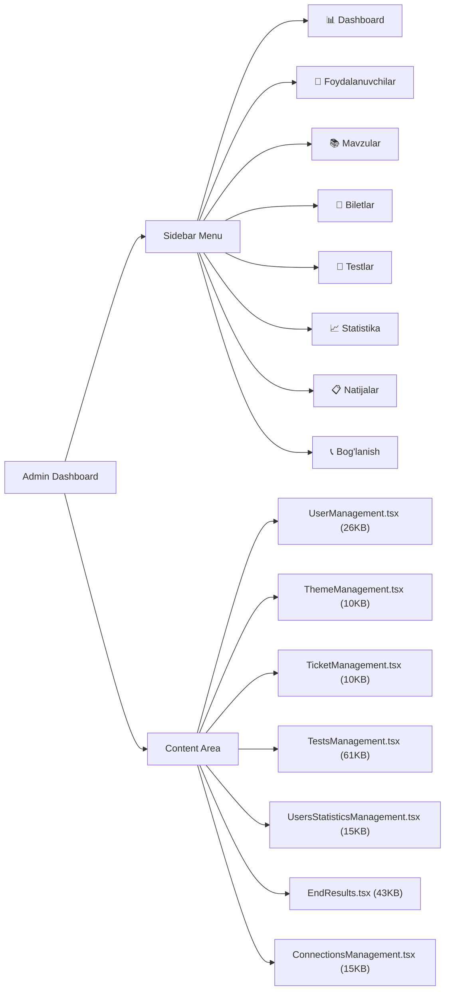
```mermaid
graph LR
    AD["Admin Dashboard"] --> S["Sidebar Menu"]
    AD --> C["Content Area"]
    
    S --> S1["📊 Dashboard"]
    S --> S2["👥 Foydalanuvchilar"]
    S --> S3["📚 Mavzular"]
    S --> S4["🎫 Biletlar"]
    S --> S5["📝 Testlar"]
    S --> S6["📈 Statistika"]
    S --> S7["📋 Natijalar"]
    S --> S8["📞 Bog'lanish"]
    
    C --> C1["UserManagement.tsx (26KB)"]
    C --> C2["ThemeManagement.tsx (10KB)"]
    C --> C3["TicketManagement.tsx (10KB)"]
    C --> C4["TestsManagement.tsx (61KB)"]
    C --> C5["UsersStatisticsManagement.tsx (15KB)"]
    C --> C6["EndResults.tsx (43KB)"]
    C --> C7["ConnectionsManagement.tsx (15KB)"]
```

### 11.2 Admin CRUD operatsiyalari

| Bo'lim | Create | Read | Update | Delete | Qo'shimcha |
|--------|--------|------|--------|--------|------------|
| **Users** | ✅ | ✅ | ✅ | ✅ | Role/Ruxsat o'zgartirish, natijalarni tozalash |
| **Themes** | ✅ | ✅ | ✅ | ✅ | — |
| **Tickets** | ✅ | ✅ | ✅ | ✅ | — |
| **Tests** | ✅ | ✅ | ✅ | ✅ | Rasm yuklash (PATCH), faollashtirish |
| **Variants** | ✅ | ✅ | ✅ | ✅ | To'g'ri javob belgilash |
| **Connections** | — | ✅ | ✅ | — | Key-value sozlamalar |

---

## 12. Telegram Bot

### 12.1 Bot arxitekturasi

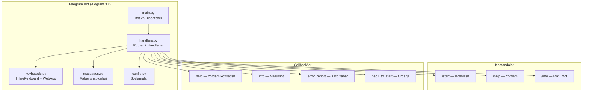
```mermaid
graph TB
    subgraph "Telegram Bot (Aiogram 3.x)"
        M["main.py<br/>Bot va Dispatcher"]
        H["handlers.py<br/>Router + Handlerlar"]
        K["keyboards.py<br/>InlineKeyboard + WebApp"]
        MSG["messages.py<br/>Xabar shablonlari"]
        CFG["config.py<br/>Sozlamalar"]
    end
    
    M --> H
    H --> K
    H --> MSG
    H --> CFG
    
    subgraph "Komandalar"
        C1["/start — Boshlash"]
        C2["/help — Yordam"]
        C3["/info — Ma'lumot"]
    end
    
    subgraph "Callback'lar"
        CB1["help — Yordam ko'rsatish"]
        CB2["info — Ma'lumot"]
        CB3["error_report — Xato xabar"]
        CB4["back_to_start — Orqaga"]
    end
    
    H --> C1
    H --> C2
    H --> C3
    H --> CB1
    H --> CB2
    H --> CB3
    H --> CB4
```

### 12.2 Bot xabar boshqaruvi

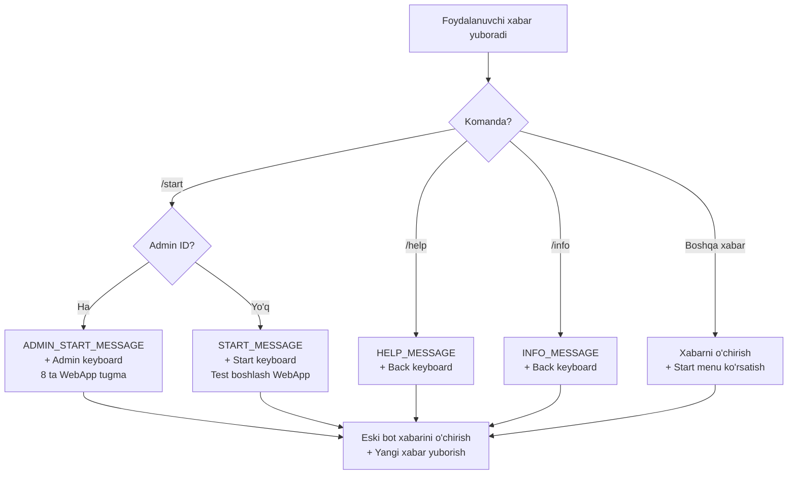
```mermaid
flowchart TD
    A[Foydalanuvchi xabar yuboradi] --> B{Komanda?}
    
    B -->|/start| C{Admin ID?}
    C -->|Ha| D[ADMIN_START_MESSAGE<br/>+ Admin keyboard<br/>8 ta WebApp tugma]
    C -->|Yo'q| E[START_MESSAGE<br/>+ Start keyboard<br/>Test boshlash WebApp]
    
    B -->|/help| F[HELP_MESSAGE<br/>+ Back keyboard]
    B -->|/info| G[INFO_MESSAGE<br/>+ Back keyboard]
    B -->|Boshqa xabar| H[Xabarni o'chirish<br/>+ Start menu ko'rsatish]
    
    D --> I[Eski bot xabarini o'chirish<br/>+ Yangi xabar yuborish]
    E --> I
    F --> I
    G --> I
    H --> I
```

### 12.3 Bot konfiguratsiyasi

| Parametr | Qiymat | Tavsif |
|----------|--------|--------|
| `BOT_TOKEN` | `.env` dan | Telegram bot tokeni |
| `MINI_APP_URL` | `https://t.me/avtotesteruzbot/app` | Mini App havolasi |
| `FRONTEND_URL` | `https://avtotester.uz` | WebApp URL |
| `ADMIN_IDS` | `[7000454062]` | Admin Telegram ID'lari |
| Versiya | 3.2.0 | Bot versiyasi |

---

## 13. Deployment arxitekturasi

### 13.1 Server konfiguratsiyasi

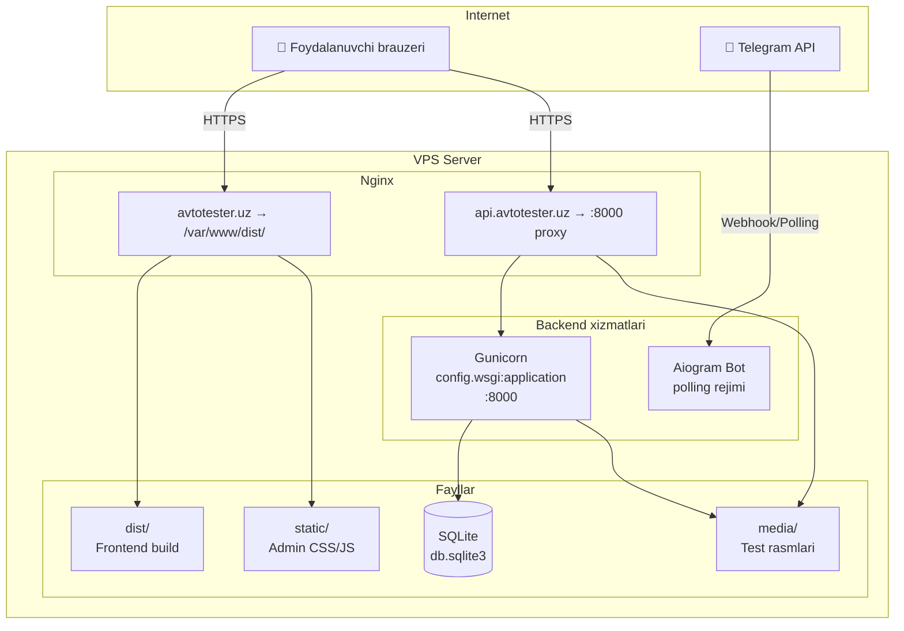
```mermaid
graph TB
    subgraph "Internet"
        CL["👤 Foydalanuvchi brauzeri"]
        TG["🤖 Telegram API"]
    end

    subgraph "VPS Server"
        subgraph "Nginx"
            N1["avtotester.uz → /var/www/dist/"]
            N2["api.avtotester.uz → :8000 proxy"]
        end
        
        subgraph "Backend xizmatlari"
            GU["Gunicorn<br/>config.wsgi:application<br/>:8000"]
            BOT["Aiogram Bot<br/>polling rejimi"]
        end
        
        subgraph "Fayllar"
            DIST["dist/<br/>Frontend build"]
            MEDIA["media/<br/>Test rasmlari"]
            DB[("SQLite<br/>db.sqlite3")]
            STATIC["static/<br/>Admin CSS/JS"]
        end
    end

    CL -->|HTTPS| N1
    CL -->|HTTPS| N2
    TG -->|Webhook/Polling| BOT
    
    N1 --> DIST
    N2 --> GU
    GU --> DB
    GU --> MEDIA
    N1 --> STATIC
    N2 --> MEDIA
```

### 13.2 Nginx konfiguratsiyasi

| Server | Port | Root/Proxy | Maqsad |
|--------|------|------------|--------|
| `avtotester.uz` | 80/443 | `/var/www/avtotester/dist` | Frontend SPA |
| `api.avtotester.uz` | 80/443 | `proxy_pass :8000` | Backend API |

### 13.3 Systemd xizmatlari

| Xizmat | Turi | Komanda | Maqsad |
|--------|------|---------|--------|
| Backend | `gunicorn` | `gunicorn config.wsgi:application -b 127.0.0.1:8000` | Django API |
| Bot | `python` | `python main.py` | Telegram bot |

---

## 14. Texnologiyalar steki

### 14.1 Backend

| Texnologiya | Versiya | Maqsad |
|-------------|---------|--------|
| Python | 3.11+ | Dasturlash tili |
| Django | 5.2.7 | Web framework |
| Django REST Framework | 3.16.1 | REST API |
| drf-spectacular | 0.29.0 | API dokumentatsiyasi (Swagger) |
| SQLite | 3.x | Ma'lumotlar bazasi |
| Pillow | 12.0.0 | Rasm ishlov berish |
| django-cors-headers | 4.9.0 | CORS sozlamalari |
| python-dotenv | 1.2.1 | Environment o'zgaruvchilari |
| Gunicorn | — | Production WSGI server |

### 14.2 Frontend

| Texnologiya | Versiya | Maqsad |
|-------------|---------|--------|
| React | 19.1.1 | UI framework |
| TypeScript | 5.9.3 | Type safety |
| Vite | 7.1.7 | Build tool va dev server |
| TailwindCSS | 4.1.16 | CSS utility framework |
| React Router | 7.9.5 | Client-side routing |
| Lucide React | 0.553.0 | Ikonkalar kutubxonasi |

### 14.3 Telegram Bot

| Texnologiya | Versiya | Maqsad |
|-------------|---------|--------|
| Aiogram | 3.x | Telegram bot framework |
| Python | 3.11+ | Dasturlash tili |

### 14.4 Infratuzilma

| Texnologiya | Maqsad |
|-------------|--------|
| Nginx | Reverse proxy, static files |
| Systemd | Service management |
| Let's Encrypt | SSL sertifikatlari |

---

## 15. Nofunksional talablar

### 15.1 Ishlash (Performance)

| Parametr | Talab |
|----------|-------|
| API javob vaqti | < 500ms |
| Sahifa yuklash | < 3 soniya |
| Fayl yuklash limiti | 50MB (DATA_UPLOAD_MAX_MEMORY_SIZE) |
| Rasm hajmi limiti | 5MB (serializer validatsiya) |
| Rasm formatlari | jpg, jpeg, png, gif, bmp, webp |

### 15.2 Xavfsizlik

| Talab | Holat |
|-------|-------|
| HTTPS | ✅ Majburiy |
| CORS himoyasi | ✅ Whitelist rejimi |
| CSRF himoyasi | ✅ Trusted origins |
| Token-based auth | ✅ UUID tokenlar |
| Parol xeshlash | ✅ Django standart |
| Role-based access | ✅ Decorator orqali |
| Input validatsiya | ✅ Serializer qatlami |

### 15.3 Moslik (Compatibility)

| Platforma | Qo'llab-quvvatlash |
|-----------|---------------------|
| Mobile browsers | ✅ Responsive dizayn |
| Desktop browsers | ✅ Chrome, Firefox, Safari, Edge |
| Telegram Mini App | ✅ WebApp orqali |
| iOS | ✅ |
| Android | ✅ |

### 15.4 Loyiha fayl tuzilishi

```
Avtotester.uz/
├── BackendAvtotester.uz/          # Backend (Django)
│   ├── api/                       # Asosiy API ilovasi
│   │   ├── models.py              # 9 ta model
│   │   ├── serializers.py         # 16+ serializer
│   │   ├── urls.py                # 30+ endpoint
│   │   ├── decorators.py          # user_required, admin_required
│   │   ├── enums.py               # RoleChoices, TestChoices
│   │   ├── admin.py               # Django admin konfiguratsiyasi
│   │   └── views/
│   │       ├── user_apis.py       # Foydalanuvchi API'lari
│   │       ├── admin_apis.py      # Admin API'lari
│   │       ├── auth_apis.py       # Login/Logout
│   │       └── public_apis.py     # Ochiq API'lar
│   ├── Bot/                       # Telegram Bot
│   │   ├── main.py                # Bot ishga tushirish
│   │   ├── handlers.py            # Komanda handlerlari
│   │   ├── keyboards.py           # Inline keyboard'lar
│   │   ├── messages.py            # Xabar shablonlari
│   │   └── config.py              # Bot sozlamalari
│   ├── config/                    # Django konfiguratsiyasi
│   │   ├── settings.py            # Asosiy sozlamalar
│   │   ├── urls.py                # Root URL'lar
│   │   └── wsgi.py                # WSGI entry point
│   ├── db.sqlite3                 # Ma'lumotlar bazasi (~60MB)
│   ├── media/                     # Yuklangan rasmlar (730+)
│   ├── requirements.txt           # Python bog'liqliklar
│   └── manage.py                  # Django CLI
│
└── FrontAvtotester.uz/            # Frontend (React)
    ├── src/
    │   ├── App.tsx                 # Root komponent
    │   ├── main.tsx                # Entry point
    │   ├── routes/
    │   │   └── AppRoutes.tsx       # Routing konfiguratsiyasi
    │   ├── components/
    │   │   └── Layout/             # Header, Footer
    │   ├── pages/
    │   │   ├── Dashboard/          # Asosiy sahifalar
    │   │   ├── Admin/              # Admin panel (80KB+ AdminDashboard)
    │   │   ├── Auth/               # Login sahifasi
    │   │   ├── Home/               # Bosh sahifa
    │   │   ├── profile/            # Profil sahifasi
    │   │   ├── About/              # Haqida
    │   │   └── Others/             # NotFound, Connections
    │   └── utils/
    │       ├── Backend.tsx         # ServerConnection class
    │       ├── Admin.tsx           # Admin API helper
    │       └── latinToCyrillic.tsx # Konvertatsiya
    ├── dist/                       # Production build
    ├── package.json                # NPM bog'liqliklar
    ├── vite.config.ts              # Vite konfiguratsiyasi
    └── index.html                  # SPA entry HTML
```

---

> **📌 Eslatma:** Ushbu BRP hujjati AvtoTester.uz loyihasining joriy holatini to'liq aks ettiradi. Loyiha ishlab chiqilayotgan bo'lgani uchun, yangi xususiyatlar qo'shilganda ushbu hujjat yangilanishi kerak.

---

*Hujjat yaratilgan sana: 2026-02-25 | Versiya: 1.0.0*


# 🚗 AvtoTester.uz — Biznes Talablar Rejasi (BRP)

<div align="center">


**O'zbekiston Respublikasida haydovchilik guvohnomasi imtihoniga tayyorlanish platformasi**

[🌐 Web](https://avtotester.uz) · [📡 API](https://api.avtotester.uz) · [🤖 Bot](https://t.me/AvtoTesterUzBot) · [👨‍💻 Muallif](https://t.me/islomiddin903)

</div>

---

## 📑 Mundarija

<table>
<tr>
<td width="50%">

**I. Umumiy qism**
- [1. Loyiha haqida](#1--loyiha-haqida)
- [2. Maqsad va vazifalar](#2--maqsad-va-vazifalar)
- [3. Foydalanuvchi rollari](#3--foydalanuvchi-rollari)
- [4. Tizim arxitekturasi](#4--tizim-arxitekturasi)
- [5. Ma'lumotlar bazasi](#5--malumotlar-bazasi)

</td>
<td width="50%">

**II. Texnik qism**
- [6. Funksional talablar](#6--funksional-talablar)
- [7. API hujjatlari](#7--api-hujjatlari)
- [8. Autentifikatsiya](#8--autentifikatsiya-va-xavfsizlik)
- [9. Algoritmlar](#9--algoritmlar-va-biznes-logikasi)
- [10. Frontend](#10--frontend-sahifalar)
- [11. Admin panel](#11--admin-panel)
- [12. Telegram Bot](#12--telegram-bot)
- [13. Deployment](#13--deployment)
- [14. Texnologiyalar](#14--texnologiyalar-steki)
- [15. Nofunksional talablar](#15--nofunksional-talablar)

</td>
</tr>
</table>

---

## 1. 🎯 Loyiha haqida

**AvtoTester.uz** — O'zbekistonda haydovchilik guvohnomasi olish uchun imtihonga tayyorlanish platformasi. Platforma 3 ta kanal orqali xizmat ko'rsatadi: **veb-ilova**, **REST API** va **Telegram bot**.

### 1.1 Asosiy xususiyatlar

<table>
<tr>
<td align="center" width="14%">📚<br/><b>Mavzu</b><br/><sub>Mavzu bo'yicha testlar</sub></td>
<td align="center" width="14%">🎫<br/><b>Bilet</b><br/><sub>Bilet bo'yicha testlar</sub></td>
<td align="center" width="14%">📝<br/><b>SetTest</b><br/><sub>Tasodifiy testlar</sub></td>
<td align="center" width="14%">🎓<br/><b>Imtihon</b><br/><sub>Real simulyatsiya</sub></td>
<td align="center" width="14%">📊<br/><b>Statistika</b><br/><sub>Natija tahlili</sub></td>
<td align="center" width="14%">👨‍💼<br/><b>Admin</b><br/><sub>To'liq boshqaruv</sub></td>
<td align="center" width="14%">🤖<br/><b>Bot</b><br/><sub>Telegram Mini App</sub></td>
</tr>
</table>

### 1.2 Loyiha miqyosi

| Ko'rsatkich | Qiymat | Tavsif |
|:------------|:------:|:-------|
| Test savollari | **600+** | Rasmiy YHQ bazasidagi savollar |
| Mavzular | **20+** | Yo'l harakati qoidalari bo'limlari |
| Biletlar | **40+** | Rasmiy imtihon biletlari |
| Media fayllar | **730+** | Test rasmlari (images/) |
| DB hajmi | **~60MB** | SQLite ma'lumotlar bazasi |
| Frontend | **80KB+** | Admin panel (AdminDashboard.tsx) |
| API | **30+** | REST API endpointlar |

---

## 2. 🏆 Maqsad va vazifalar

### 2.1 Asosiy maqsad

> Foydalanuvchilarga haydovchilik guvohnomasi imtihoniga **samarali** va **interaktiv** tayyorlanish imkoniyatini berish.

### 2.2 Strategik vazifalar

| # | Yo'nalish | Vazifa | Holat |
|:-:|:---------:|:-------|:-----:|
| 1 | 📚 Ta'lim | Mavzu va biletlar bo'yicha o'rganish tizimi | ✅ |
| 2 | 🎓 Imtihon | Real imtihon sharoitlarini 100% simulyatsiya | ✅ |
| 3 | 📊 Tahlil | Shaxsiy statistika va taraqqiyot monitoring | ✅ |
| 4 | ��‍💼 Boshqaruv | Admin panel orqali to'liq kontent boshqaruvi | ✅ |
| 5 | 🤖 Qulaylik | Telegram Mini App orqali tez va oson kirish | ✅ |
| 6 | 🔐 Xavfsizlik | Token-based auth, role-based access control | ✅ |
| 7 | 📱 Moslik | Responsive dizayn (mobile/desktop/tablet) | ✅ |

### 2.3 Imtihon standartlari

<table>
<tr>
<td align="center">⏱️<br/><b>20 daqiqa</b><br/><sub>Imtihon vaqti</sub></td>
<td align="center">📋<br/><b>20 savol</b><br/><sub>Tasodifiy tanlangan</sub></td>
<td align="center">✅<br/><b>18/20 (90%)</b><br/><sub>O'tish bali</sub></td>
<td align="center">❌<br/><b>3 xato = STOP</b><br/><sub>Avtomatik tugatish</sub></td>
</tr>
</table>

---

## 3. 👥 Foydalanuvchi rollari

### 3.1 Rol tuzilishi

```mermaid
%%{init: {'theme': 'default'}}%%
graph TD
    A[Foydalanuvchilar] --> B[STUDENT - Talaba]
    A --> C[ADMIN - Boshqaruvchi]

    B --> B1[Test yechish]
    B --> B2[Statistika korish]
    B --> B3[Profil tahrirlash]
    B --> B4[Imtihon topshirish]

    C --> C1[Barcha STUDENT imkoniyatlari]
    C --> C2[Foydalanuvchilar CRUD]
    C --> C3[Test kontent CRUD]
    C --> C4[Statistika va hisobotlar]
    C --> C5[Ruxsatlar boshqaruvi]
```

### 3.2 Rollar tafsili

<table>
<tr>
<th width="15%">Rol</th>
<th width="10%">Enum</th>
<th width="35%">Tavsif</th>
<th width="40%">Ruxsatlar</th>
</tr>
<tr>
<td>👨‍🎓 <b>Talaba</b></td>
<td><code>STUDENT</code></td>
<td>Oddiy foydalanuvchi — test yechadi va statistikasini ko'radi</td>
<td>✅ Test yechish (4 tur) · ✅ Statistika · ✅ Profil tahrirlash · ❌ Admin panel</td>
</tr>
<tr>
<td>👨‍💼 <b>Admin</b></td>
<td><code>ADMIN</code></td>
<td>Tizim boshqaruvchisi — to'liq CRUD va statistika</td>
<td>✅ Barcha STUDENT ruxsatlari · ✅ User CRUD · ✅ Test CRUD · ✅ Statistika · ✅ Ruxsatlar</td>
</tr>
</table>

### 3.3 Maxsus ruxsatlar

| Ruxsat | Model maydoni | Turi | Beriladi | Tavsif |
|:-------|:-------------|:----:|:--------:|:-------|
| **Imtihon ruxsati** | `User.ruxsat` | `boolean` | Admin tomonidan | `False` = imtihonga kirish bloklangan |
| **Staff holati** | `User.is_staff` | `boolean` | Superuser | Django admin paneliga kirish |
| **Superuser** | `User.is_superuser` | `boolean` | Manual | Barcha ruxsatlar |

---

## 4. 🏗️ Tizim arxitekturasi

### 4.1 Umumiy arxitektura

```mermaid
%%{init: {'theme': 'default'}}%%
graph TB
    subgraph Klient
        FE[Frontend - React TS Vite]
        TG[Telegram Bot - Aiogram 3.x]
        MA[Telegram Mini App - WebApp]
    end

    subgraph Server
        NG[Nginx - Reverse Proxy]
        GU[Gunicorn - WSGI Server]
        DJ[Django 5.2 + DRF 3.16]
    end

    subgraph Malumotlar
        DB[(SQLite - 60MB)]
        FS[Media Files - 730 fayl]
        ST[Static Files - CSS JS]
    end

    FE -->|REST API HTTPS| NG
    TG -->|Mini App URL| MA
    MA -->|WebApp| FE
    NG -->|Proxy :8000| GU
    GU --> DJ
    DJ --> DB
    DJ --> FS
    NG --> ST
    NG --> FS
```

### 4.2 So'rov oqimi (Request Flow)

```mermaid
%%{init: {'theme': 'default'}}%%
sequenceDiagram
    participant U as Foydalanuvchi
    participant F as Frontend
    participant N as Nginx
    participant D as Django + DRF
    participant DB as SQLite

    U->>F: Sahifani ochish
    F->>N: API sorov + Auth token
    N->>D: Proxy pass :8000
    D->>D: Token tekshirish (decorator)
    D->>DB: ORM Query
    DB-->>D: Malumot
    D-->>N: JSON Response
    N-->>F: JSON data
    F-->>U: UI renderlanadi
```

### 4.3 Domenlar va portlar

| Domen | Xizmat | Port | Tavsif |
|:------|:-------|:----:|:-------|
| `avtotester.uz` | Nginx → static files | 443 | Frontend SPA (React build) |
| `api.avtotester.uz` | Nginx → Gunicorn | 443 → 8000 | Django REST API |
| `t.me/AvtoTesterUzBot` | Aiogram polling | — | Telegram Bot + Mini App |

---

## 5. 💾 Ma'lumotlar bazasi

### 5.1 ER Diagramma

```mermaid
%%{init: {'theme': 'default'}}%%
erDiagram
    User ||--o{ Result : yechadi
    User ||--o| UserSession : sessiya
    Theme ||--o{ Test : mavzu
    Ticket ||--o{ Test : bilet
    Test ||--o{ Variant : variantlar
    Test ||--o| Variant : togri_javob
    Result ||--o{ TestSheet : varaqlari
    Test ||--o{ TestSheet : savoli
    TestSheet }o--o| Variant : tanlangan

    User {
        int id PK
        string username UK
        string password
        string full_name
        string role
        boolean ruxsat
        boolean is_staff
        boolean is_active
        datetime date_joined
        datetime last_login
    }

    Theme {
        int id PK
        string name
    }

    Ticket {
        int id PK
        string name
    }

    Test {
        int id PK
        text value
        image image
        boolean active
        int correct_answer FK
        int theme FK
        int ticket FK
        datetime created_at
    }

    Variant {
        int id PK
        text value
        int test FK
        datetime created_at
    }

    Result {
        int id PK
        int user FK
        text description
        int test_length
        int true_answers
        int incorrect_answers
        string test_type
        boolean finished
        datetime start_time
        datetime end_time
    }

    TestSheet {
        int id PK
        int result FK
        int test FK
        json variant_orders
        int current_answer FK
        boolean selected
        boolean successful
        datetime created_at
    }

    UserSession {
        int id PK
        int user FK
        uuid token UK
        string device_info
        ip ip_address
        datetime created_at
        datetime updated_at
    }

    Data {
        int id PK
        string key UK
        string value
    }
```

### 5.2 Modellar batafsil

<table>
<tr><th>Model</th><th>Maydonlar</th><th>Muhim xususiyatlar</th></tr>
<tr>
<td><b>User</b><br/><sub>Foydalanuvchi</sub></td>
<td><code>id</code>, <code>username</code>, <code>password</code>, <code>full_name</code>, <code>role</code>, <code>ruxsat</code>, <code>is_staff</code>, <code>is_active</code></td>
<td>• <code>AbstractUser</code> dan vorislik<br/>• <code>role</code>: ADMIN | STUDENT<br/>• <code>ruxsat</code>: imtihonga kirish</td>
</tr>
<tr>
<td><b>Test</b><br/><sub>Test savoli</sub></td>
<td><code>id</code>, <code>value</code>, <code>image</code>, <code>active</code>, <code>correct_answer</code>, <code>theme</code>, <code>ticket</code></td>
<td>• Rasm yuklash + eski rasm avtomatik o'chirish<br/>• <code>correct_answer=NULL</code> → <code>active=False</code><br/>• <code>save()</code> override: faollik tekshiruvi</td>
</tr>
<tr>
<td><b>Variant</b><br/><sub>Javob varianti</sub></td>
<td><code>id</code>, <code>value</code>, <code>test</code></td>
<td>• Testga ForeignKey<br/>• Test o'chirilganda kaskad o'chirish</td>
</tr>
<tr>
<td><b>Result</b><br/><sub>Test natijasi</sub></td>
<td><code>id</code>, <code>user</code>, <code>test_length</code>, <code>true_answers</code>, <code>incorrect_answers</code>, <code>test_type</code>, <code>finished</code></td>
<td>• <code>test_type</code>: THEME | TICKET | SETTEST | EXAM<br/>• <code>finished=False</code> → test hali yechilmoqda<br/>• <code>start_time</code> / <code>end_time</code>: vaqt hisoblash</td>
</tr>
<tr>
<td><b>TestSheet</b><br/><sub>Test varaqasi</sub></td>
<td><code>id</code>, <code>result</code>, <code>test</code>, <code>variant_orders</code>, <code>current_answer</code>, <code>successful</code></td>
<td>• <code>variant_orders</code>: JSON — variantlar tartibi<br/>• <code>successful</code>: null (javob berilmagan) | true | false<br/>• <code>save()</code>: variant tartibini saqlash</td>
</tr>
<tr>
<td><b>UserSession</b><br/><sub>Sessiya</sub></td>
<td><code>id</code>, <code>user</code>, <code>token</code>, <code>device_info</code>, <code>ip_address</code></td>
<td>• OneToOne: bitta userga bitta sessiya<br/>• <code>token</code>: UUID4, unique<br/>• Qurilma cheklovi (device_info)</td>
</tr>
<tr>
<td><b>Data</b><br/><sub>Sozlamalar</sub></td>
<td><code>id</code>, <code>key</code>, <code>value</code></td>
<td>• Key-value dinamik sozlamalar<br/>• telegram_link, phone_number, instagram, youtube</td>
</tr>
</table>

---

## 6. ⚡ Funksional talablar

### 6.1 Test turlari

```mermaid
%%{init: {'theme': 'default'}}%%
graph LR
    T1[THEME - Mavzu] --> R1[Tanlangan mavzudagi barcha faol testlar]
    T2[TICKET - Bilet] --> R2[Tanlangan biletdagi barcha faol testlar]
    T3[SETTEST - Tasodifiy] --> R3[N ta tasodifiy faol testlar]
    T4[EXAM - Imtihon] --> R4[20 ta tasodifiy + vaqt + xato limiti]
```

### 6.2 Test turlari taqqoslash

| Xususiyat | 📚 THEME | 🎫 TICKET | 📝 SETTEST | 🎓 EXAM |
|:----------|:--------:|:---------:|:----------:|:-------:|
| Savollar soni | Mavzudagi barcha | Biletdagi barcha | Foydalanuvchi tanlaydi | **20 ta** |
| Vaqt cheklovi | ❌ | ❌ | ❌ | **20 daqiqa** |
| Xato limiti | ❌ | ❌ | ❌ | **3 ta** |
| Tasodifiy tartib | ❌ | ❌ | ✅ | ✅ |
| O'tish bali | — | — | — | **18/20 (90%)** |
| Ruxsat kerak | ❌ | ❌ | ❌ | ✅ `ruxsat=True` |
| Javob rangi | 🟢🔴 | 🟢🔴 | 🟢🔴 | 🟢🔴 |

### 6.3 Javob ranglari tizimi

| Rang | Holat | Tavsif |
|:----:|:------|:-------|
| 🔵 Ko'k | Tanlangan | Variant tanlangan, lekin hali yuborilmagan |
| 🟢 Yashil | To'g'ri | Javob to'g'ri — `successful=True` |
| 🔴 Qizil | Noto'g'ri | Javob xato — `successful=False` |
| ⚫ Kulrang | Tanlanmagan | Hech qanday variant tanlanmagan |

### 6.4 Talaba funksiyalari (12 ta)

| # | Funksiya | API endpoint | Method |
|:-:|:---------|:------------|:------:|
| 1 | Tizimga kirish | `/api/auth/login/` | POST |
| 2 | Tizimdan chiqish | `/api/auth/logout/` | POST |
| 3 | Profilni ko'rish | `/api/profile/` | GET |
| 4 | Profilni tahrirlash | `/api/profile/` | PUT |
| 5 | Mavzular ro'yxati | `/api/themes/` | GET |
| 6 | Biletlar ro'yxati | `/api/tickets/` | GET |
| 7 | Test boshlash (4 tur) | `/api/start_tests/start_*` | POST |
| 8 | Test savollarini olish | `/api/result/{id}/tests/` | GET |
| 9 | Javob yuborish | `/api/solve_tests/{id}/answer/` | POST |
| 10 | Testni tugatish | `/api/solve_tests/{id}/finish/` | POST |
| 11 | Statistikani ko'rish | `/api/statistics/` | GET |
| 12 | Natijalar tarixini ko'rish | `/api/results/` | GET |

### 6.5 Admin funksiyalari (15 ta)

| # | Funksiya | API endpoint | Method |
|:-:|:---------|:------------|:------:|
| 1 | Foydalanuvchi yaratish | `/api/admin/user/` | POST |
| 2 | Foydalanuvchilar ro'yxati | `/api/admin/user/` | GET |
| 3 | Foydalanuvchini tahrirlash | `/api/admin/user/{id}/` | PUT |
| 4 | Foydalanuvchini o'chirish | `/api/admin/user/{id}/` | DELETE |
| 5 | Mavzu yaratish/ko'rish | `/api/admin/theme/` | POST/GET |
| 6 | Mavzu tahrirlash/o'chirish | `/api/admin/theme/{id}/` | PUT/DELETE |
| 7 | Bilet yaratish/ko'rish | `/api/admin/ticket/` | POST/GET |
| 8 | Bilet tahrirlash/o'chirish | `/api/admin/ticket/{id}/` | PUT/DELETE |
| 9 | Test yaratish (rasm bilan) | `/api/admin/test/` | POST |
| 10 | Test tahrirlash/o'chirish | `/api/admin/test/{id}/` | PUT/DELETE |
| 11 | Test rasmini yuklash | `/api/admin/test/{id}/` | PATCH |
| 12 | Variant yaratish/boshqarish | `/api/admin/test/{id}/variant/` | POST/GET |
| 13 | To'g'ri javob belgilash | `/api/admin/test/variant/{id}/true/` | POST |
| 14 | Umumiy statistika | `/api/admin/statistics/` | GET |
| 15 | Bog'lanish sozlamalari | `/api/public/connection/` | PUT |

---

## 7. 📡 API hujjatlari

### 7.1 Autentifikatsiya

<table>
<tr><th>Method</th><th>Endpoint</th><th>Auth</th><th>Body / Response</th></tr>
<tr>
<td><code>POST</code></td>
<td><code>/api/auth/login/</code></td>
<td>❌</td>
<td><b>Body:</b> <code>{"username", "password", "force_login?"}</code><br/><b>Response:</b> <code>{"token": "uuid"}</code></td>
</tr>
<tr>
<td><code>POST</code></td>
<td><code>/api/auth/logout/</code></td>
<td>✅ User</td>
<td><b>Response:</b> <code>{"message": "Logged out"}</code></td>
</tr>
</table>

### 7.2 Foydalanuvchi API

| Method | Endpoint | Auth | Tavsif |
|:------:|:---------|:----:|:-------|
| `GET` | `/api/profile/` | ✅ User | Profil ma'lumotlari: id, username, full_name, role, ruxsat |
| `PUT` | `/api/profile/` | ✅ User | Faqat `full_name` o'zgartiriladi |
| `GET` | `/api/themes/` | ✅ User | Barcha mavzular (name bo'yicha tartiblangan) |
| `GET` | `/api/tickets/` | ✅ User | Barcha biletlar (id bo'yicha tartiblangan) |
| `GET` | `/api/statistics/` | ✅ User | Shaxsiy: total_tests, avg_score, best_score |
| `GET` | `/api/results/` | ✅ User | Imtihon natijalari tarixi (oxirgi 20/50 ta) |

### 7.3 Test API

| Method | Endpoint | Auth | Tavsif |
|:------:|:---------|:----:|:-------|
| `POST` | `/api/start_tests/start_theme/` | ✅ User | Body: `{"theme_id": int}` |
| `POST` | `/api/start_tests/start_ticket/` | ✅ User | Body: `{"ticket_id": int}` |
| `POST` | `/api/start_tests/start_settest/` | ✅ User | Body: `{"count": int}` |
| `POST` | `/api/start_tests/start_exam/` | ✅ User | Body: `{"count": 20}` |
| `GET` | `/api/result/{id}/tests/` | ✅ User | Savollar + variantlar + javoblar |
| `POST` | `/api/solve_tests/{id}/answer/` | ✅ User | Body: `{"variant_id": int}` |
| `POST` | `/api/solve_tests/{id}/finish/` | ✅ User | Testni tugatish |
| `GET` | `/api/result/{id}/statistics/` | ✅ User | Natija tahlili |

### 7.4 Admin API

| Method | Endpoint | Auth | Tavsif |
|:------:|:---------|:----:|:-------|
| `GET/POST` | `/api/admin/user/` | ✅ Admin | Foydalanuvchilar ro'yxati / yaratish |
| `GET/PUT/DELETE` | `/api/admin/user/{id}/` | ✅ Admin | Foydalanuvchi operatsiyalari |
| `GET/POST` | `/api/admin/theme/` | ✅ Admin | Mavzular CRUD |
| `GET/PUT/DELETE` | `/api/admin/theme/{id}/` | ✅ Admin | Mavzu operatsiyalari |
| `GET/POST` | `/api/admin/ticket/` | ✅ Admin | Biletlar CRUD |
| `GET/PUT/DELETE` | `/api/admin/ticket/{id}/` | ✅ Admin | Bilet operatsiyalari |
| `GET/POST` | `/api/admin/test/` | ✅ Admin | Testlar CRUD (MultiPart) |
| `GET/PUT/DELETE/PATCH` | `/api/admin/test/{id}/` | ✅ Admin | Test op. (PATCH=rasm) |
| `GET/POST` | `/api/admin/test/{id}/variant/` | ✅ Admin | Variantlar CRUD |
| `POST` | `/api/admin/test/variant/{id}/true/` | ✅ Admin | To'g'ri javob belgilash |
| `GET` | `/api/admin/statistics/` | ✅ Admin | Umumiy statistika |
| `GET` | `/api/admin/all_users_stats/` | ✅ Admin | Barcha userlar statistikasi |
| `GET` | `/api/admin/user_statistics/{uid}/` | ✅ Admin | User statistikasi |
| `GET/PUT` | `/api/public/connection/` | PUT: Admin | Bog'lanish sozlamalari |

### 7.5 API so'rov oqimi

```mermaid
%%{init: {'theme': 'default'}}%%
sequenceDiagram
    participant C as Client
    participant D as Decorator
    participant V as View
    participant S as Serializer
    participant DB as Database

    C->>D: Request + Auth Header
    D->>D: Token tekshirish
    alt Token yaroqsiz
        D-->>C: 401 Unauthorized
    end
    D->>V: request.user = user
    alt Admin endpoint
        D->>D: Role tekshirish
        alt Admin emas
            D-->>C: 403 Forbidden
        end
    end
    V->>S: Serializatsiya
    S->>DB: ORM Query
    DB-->>S: Natija
    S-->>V: Validated data
    V-->>C: JSON Response
```

---

## 8. 🔐 Autentifikatsiya va xavfsizlik

### 8.1 Login jarayoni

```mermaid
%%{init: {'theme': 'default'}}%%
flowchart TD
    A[Login sorovi] --> B{Username va password togri?}
    B -->|Yoq| C[400: Invalid credentials]
    B -->|Ha| D{Mavjud sessiya bor?}

    D -->|Yoq| E[Yangi sessiya yaratish]
    E --> F[200: Token qaytarish]

    D -->|Ha| G{device_info null?}
    G -->|Ha| H[device_info yangilash]
    H --> F

    G -->|Yoq| I{Xuddi shu qurilma?}
    I -->|Ha| J[IP yangilash]
    J --> F

    I -->|Yoq| K{force_login = true?}
    K -->|Ha| L[Eski sessiya ochirish]
    L --> F
    K -->|Yoq| M[403: DEVICE_CONFLICT]
```

### 8.2 Token autentifikatsiyasi

```mermaid
%%{init: {'theme': 'default'}}%%
flowchart LR
    A[Sorov] --> B{Auth header bor?}
    B -->|Yoq| C[401: Missing header]
    B -->|Ha| D[Token ajratish]
    D --> E{SessionDB da topildi?}
    E -->|Yoq| F[401: Invalid token]
    E -->|Ha| G[request.user = user]
    G --> H[View funksiyasi]
```

### 8.3 Xavfsizlik choralari

| # | Chora | Holat | Amalga oshirish | Tavsif |
|:-:|:------|:-----:|:----------------|:-------|
| 1 | **CORS** | ✅ | `django-cors-headers` | Faqat `avtotester.uz`, `localhost:5173` |
| 2 | **CSRF** | ✅ | Django middleware | Trusted origins: `avtotester.uz`, `api.avtotester.uz` |
| 3 | **Token Auth** | ✅ | Custom decorator | UUID4 tokenlar, `UserSession` model orqali |
| 4 | **Device Lock** | ✅ | Login view | Bitta qurilmadan kirish, `force_login` bilan override |
| 5 | **Role Check** | ✅ | `admin_required` decorator | `is_staff` yoki `role=ADMIN` tekshiruvi |
| 6 | **Password** | ✅ | Django `set_password()` | PBKDF2 xeshlash algoritmi |
| 7 | **File Check** | ✅ | Serializer validatsiya | Max 5MB, faqat: jpg, jpeg, png, gif, bmp, webp |
| 8 | **HTTPS** | ✅ | Nginx + Let's Encrypt | Barcha trafik shifrlangan |

---

## 9. ⚙️ Algoritmlar va biznes logikasi

### 9.1 Test boshlash algoritmi

```mermaid
%%{init: {'theme': 'default'}}%%
flowchart TD
    A[Test boshlash sorovi] --> B{Test turi?}

    B -->|THEME| C[Theme topish va faol testlarni olish]
    B -->|TICKET| D[Ticket topish va faol testlarni olish]
    B -->|SETTEST| E[Barcha faol testlardan N ta tasodifiy tanlash]
    B -->|EXAM| F[Barcha faol testlardan 20 ta tasodifiy tanlash]

    C --> O{Testlar mavjud?}
    D --> O
    E --> O
    F --> O

    O -->|Yoq| P[400: Testlar mavjud emas]
    O -->|Ha| Q[Tugatilmagan natijalarni ochirish]
    Q --> R[Result yaratish]
    R --> S[Har bir test uchun TestSheet yaratish]
    S --> T[201: Result qaytarish]
```

### 9.2 Javob berish algoritmi

```mermaid
%%{init: {'theme': 'default'}}%%
flowchart TD
    A[Javob yuborish - variant_id] --> B{Test tugatilgan?}
    B -->|Ha| C[400: Allaqachon tugatilgan]

    B -->|Yoq| D{EXAM va vaqt tugagan?}
    D -->|Ha| E[Avtomatik tugatish]

    D -->|Yoq| G{Javob berilgan?}
    G -->|Ha| H[400: Javob belgilangan]

    G -->|Yoq| I[Javobni saqlash]
    I --> J{Javob togri?}

    J -->|Ha| K[true_answers += 1]
    J -->|Yoq| L[incorrect_answers += 1]

    K --> M[TestSheet saqlash]
    L --> M

    M --> N{EXAM va xatolar >= 3?}
    N -->|Ha| O[Imtihon tugatish - 3 xato]
    N -->|Yoq| P[Natijani qaytarish]
```

### 9.3 Test hayot sikli

```mermaid
%%{init: {'theme': 'default'}}%%
stateDiagram-v2
    [*] --> Yaratilgan: Test yaratildi
    Yaratilgan --> VariantlarQoshilgan: Variantlar qoshildi
    VariantlarQoshilgan --> JavobBelgilangan: Togri javob belgilandi
    JavobBelgilangan --> Faol: Admin faollashtirdi
    Faol --> Nofaol: Admin nofaol qildi
    Nofaol --> Faol: Qayta faollashtirish
    Yaratilgan --> Muammoli: correct_answer NULL
    VariantlarQoshilgan --> Muammoli: correct_answer NULL
    Muammoli --> JavobBelgilangan: Togri javob belgilandi
    Faol --> [*]: Test ochirildi
    Nofaol --> [*]: Test ochirildi
```

### 9.4 Natija hisoblash pseudocode

```python
def calculate_exam_result(result):
    all_q     = result.test_length           # Jami: 20
    trues     = result.true_answers          # To'g'ri javoblar
    falses    = result.incorrect_answers     # Noto'g'ri javoblar
    ignores   = all_q - trues - falses       # Javob berilmagan
    percent   = round((trues / all_q) * 100) # Foiz

    status = "MUVAFFAQIYATLI ✅" if trues >= 18 else "MUVAFFAQIYATSIZ ❌"

    return {
        "all": all_q, "trues": trues, "falses": falses,
        "ignores": ignores, "percentage": percent, "status": status
    }
```

---

## 10. 🖥️ Frontend sahifalar

### 10.1 Sahifalar xaritasi

<table>
<tr><th colspan="3">🌐 Public sahifalar (auth kerak emas)</th></tr>
<tr><td><code>/login</code></td><td>Kirish sahifasi</td><td>Username + password + force_login</td></tr>
<tr><td><code>/about</code></td><td>Haqida</td><td>Loyiha haqida ma'lumot</td></tr>
<tr><td><code>/connections</code></td><td>Bog'lanish</td><td>Telegram, telefon, Instagram, YouTube</td></tr>
<tr><th colspan="3">�� Protected sahifalar (auth kerak)</th></tr>
<tr><td><code>/</code></td><td>Dashboard</td><td>Bosh sahifa — 5 ta navigatsiya tugmasi</td></tr>
<tr><td><code>/themes</code></td><td>Mavzular</td><td>Mavzular ro'yxati va test boshlash</td></tr>
<tr><td><code>/tickets</code></td><td>Biletlar</td><td>Biletlar ro'yxati va test boshlash</td></tr>
<tr><td><code>/settests</code></td><td>SetTestlar</td><td>Savollar sonini tanlash va boshlash</td></tr>
<tr><td><code>/exam</code></td><td>Imtihon</td><td>Avtomatik 20 ta savollik imtihon</td></tr>
<tr><td><code>/testresult/:id</code></td><td>Test yechish</td><td>Savollar, variantlar, javob berish</td></tr>
<tr><td><code>/test_result/:id</code></td><td>Natija</td><td>Test natijasi — statistika va tahlil</td></tr>
<tr><td><code>/statistics</code></td><td>Statistika</td><td>Umumiy ko'rsatkichlar va grafik</td></tr>
<tr><td><code>/profile</code></td><td>Profil</td><td>Ism tahrirlash</td></tr>
<tr><th colspan="3">🛡️ Admin sahifalar (admin token kerak)</th></tr>
<tr><td><code>/admin/*</code></td><td>Admin panel</td><td>8 ta bo'limli to'liq boshqaruv paneli</td></tr>
</table>

### 10.2 Frontend arxitektura

```mermaid
%%{init: {'theme': 'default'}}%%
graph TB
    App[App.tsx - Root] --> Routes[AppRoutes.tsx]

    Routes --> Public[Public: login, about, connections]
    Routes --> Protected[Protected: auth ? Page : Login]
    Routes --> Admin[Admin: AdminRoute wrapper]

    Protected --> Pages[8 ta Dashboard sahifa]
    Admin --> AdminPages[AdminDashboard + 7 komponent]

    Pages --> SC[ServerConnection - 5 HTTP method]
    AdminPages --> SC

    SC --> API[REST API - api.avtotester.uz]
```

### 10.3 Asosiy komponentlar

| Komponent | Fayl | Hajm | Maqsad |
|:----------|:-----|:----:|:-------|
| **ServerConnection** | `utils/Backend.tsx` | 3.8KB | API aloqasi: GET, POST, PUT, PATCH, DELETE |
| **AdminHelper** | `utils/Admin.tsx` | 3.3KB | Admin API yordamchi funksiyalari |
| **latinToCyrillic** | `utils/latinToCyrillic.tsx` | 1.6KB | Lotin → Kirill konvertatsiya |
| **Layout** | `components/Layout/` | 3 fayl | Header + Footer + umumiy tuzilma |
| **AppRoutes** | `routes/AppRoutes.tsx` | 3.0KB | Routing + auth himoyasi |

---

## 11. 👨‍💼 Admin panel

### 11.1 Admin panel tuzilishi

```mermaid
%%{init: {'theme': 'default'}}%%
graph LR
    AD[Admin Dashboard - 80KB] --> S[Sidebar]
    AD --> C[Content Area]

    S --> S1[Dashboard - Statistika]
    S --> S2[Users - 26KB]
    S --> S3[Themes - 10KB]
    S --> S4[Tickets - 10KB]
    S --> S5[Tests - 61KB]
    S --> S6[Statistics - 15KB]
    S --> S7[Results - 43KB]
    S --> S8[Connections - 15KB]
```

### 11.2 Admin CRUD operatsiyalari

| Bo'lim | 📝 Create | 👁️ Read | ✏️ Update | 🗑️ Delete | ⚡ Qo'shimcha |
|:-------|:---------:|:-------:|:---------:|:---------:|:-------------|
| **Users** | ✅ | ✅ | ✅ | ✅ | Role/Ruxsat toggle, natijalarni tozalash |
| **Themes** | ✅ | ✅ | ✅ | ✅ | Test soni ko'rsatish |
| **Tickets** | ✅ | ✅ | ✅ | ✅ | Test soni ko'rsatish |
| **Tests** | ✅ | ✅ | ✅ | ✅ | Rasm PATCH, faollashtirish, muammoli testlar |
| **Variants** | ✅ | ✅ | ✅ | ✅ | To'g'ri javob belgilash |
| **Connections** | — | ✅ | ✅ | — | telegram, phone, instagram, youtube |

---

## 12. 🤖 Telegram Bot

### 12.1 Bot arxitekturasi

```mermaid
%%{init: {'theme': 'default'}}%%
graph TB
    subgraph Bot
        M[main.py - Dispatcher]
        H[handlers.py - Router]
        K[keyboards.py - InlineKeyboard]
        MSG[messages.py - Shablonlar]
        CFG[config.py - Sozlamalar]
    end

    M --> H
    H --> K
    H --> MSG
    H --> CFG

    subgraph Komandalar
        C1[/start]
        C2[/help]
        C3[/info]
    end

    subgraph Callbacklar
        CB1[help]
        CB2[info]
        CB3[error_report]
        CB4[back_to_start]
    end

    H --> C1
    H --> C2
    H --> C3
    H --> CB1
    H --> CB2
    H --> CB3
    H --> CB4
```

### 12.2 Bot xabar oqimi

```mermaid
%%{init: {'theme': 'default'}}%%
flowchart TD
    A[Foydalanuvchi xabar] --> B{Komanda?}

    B -->|/start| C{Admin ID?}
    C -->|Ha| D[Admin keyboard - 8 WebApp tugma]
    C -->|Yoq| E[Start keyboard - Test WebApp]

    B -->|/help| F[Yordam xabari]
    B -->|/info| G[Bot malumoti]
    B -->|Boshqa| H[Xabar ochirish + Start menu]

    D --> I[Eski xabar ochirish va yangi yuborish]
    E --> I
    F --> I
    G --> I
    H --> I
```

### 12.3 Bot konfiguratsiyasi

| Parametr | Qiymat | Manba |
|:---------|:-------|:------|
| `BOT_TOKEN` | `8488911...` | `.env` fayl |
| `MINI_APP_URL` | `https://t.me/avtotesteruzbot/app?mode=fullscreen` | Hardcoded |
| `FRONTEND_URL` | `https://avtotester.uz` | Hardcoded |
| `ADMIN_IDS` | `[7000454062]` | Hardcoded |
| `BOT_NAME` | `AutoTest Bot` | Hardcoded |
| `BOT_VERSION` | `3.2.0` | Hardcoded |
| `DEVELOPER_ID` | `7000454062` | keyboards.py |

### 12.4 Mini App integratsiyasi

| Tugma | URL | Foydalanuvchi |
|:------|:----|:------------:|
| 🚗 Test ishlash | `https://avtotester.uz` | Barcha |
| 📊 Dashboard | `https://avtotester.uz/admin/dashboard` | Admin |
| 👥 Foydalanuvchilar | `https://avtotester.uz/admin/users` | Admin |
| 📈 Statistika | `https://avtotester.uz/admin/statistics` | Admin |
| 📋 Natijalar | `https://avtotester.uz/admin/results` | Admin |
| 📚 Mavzular | `https://avtotester.uz/admin/themes` | Admin |
| 🎫 Biletlar | `https://avtotester.uz/admin/tickets` | Admin |
| 📝 Testlar | `https://avtotester.uz/admin/tests` | Admin |

---

## 13. 🚀 Deployment

### 13.1 Server arxitekturasi

```mermaid
%%{init: {'theme': 'default'}}%%
graph TB
    subgraph Internet
        CL[Foydalanuvchi brauzeri]
        TGA[Telegram API]
    end

    subgraph VPS
        subgraph Nginx
            N1[avtotester.uz - static]
            N2[api.avtotester.uz - proxy]
        end

        GU[Gunicorn :8000]
        BOT[Aiogram polling]

        DIST[dist/ - React build]
        MEDIA[media/ - Rasmlar]
        DB[(SQLite)]
    end

    CL -->|HTTPS| N1
    CL -->|HTTPS| N2
    TGA -->|Polling| BOT
    N1 --> DIST
    N2 --> GU
    GU --> DB
    GU --> MEDIA
```

### 13.2 Nginx konfiguratsiyasi

| Server | Tinglash | Root / Proxy | Qo'shimcha |
|:-------|:--------:|:-------------|:-----------|
| `avtotester.uz` | 80 → 443 | `/var/www/avtotester/dist` | `try_files $uri /index.html` |
| `api.avtotester.uz` | 80 → 443 | `proxy_pass :8000` | `/static/`, `/media/` alias |

### 13.3 Environment variables

| Fayl | O'zgaruvchi | Tavsif |
|:-----|:-----------|:-------|
| Backend `.env` | `SECRET_KEY` | Django maxfiy kalit |
| Backend `.env` | `DEBUG` | `True` (dev) / `False` (prod) |
| Backend `.env` | `BOT_TOKEN` | Telegram bot tokeni |
| Frontend `.env` | `VITE_BACKEND_URL` | `https://api.avtotester.uz/api` |

---

## 14. 🛠️ Texnologiyalar steki

### 14.1 Backend

| Texnologiya | Versiya | Maqsad | Litsenziya |
|:------------|:-------:|:-------|:----------:|
| Python | 3.11+ | Dasturlash tili | PSF |
| Django | 5.2.7 | Web framework | BSD |
| Django REST Framework | 3.16.1 | REST API | BSD |
| drf-spectacular | 0.29.0 | Swagger/OpenAPI | BSD |
| SQLite | 3.x | Ma'lumotlar bazasi | Public Domain |
| Pillow | 12.0.0 | Rasm ishlov berish | HPND |
| django-cors-headers | 4.9.0 | CORS | MIT |
| python-dotenv | 1.2.1 | .env fayl | BSD |
| Gunicorn | latest | WSGI server | MIT |

### 14.2 Frontend

| Texnologiya | Versiya | Maqsad | Litsenziya |
|:------------|:-------:|:-------|:----------:|
| React | 19.1.1 | UI framework | MIT |
| TypeScript | 5.9.3 | Type safety | Apache 2.0 |
| Vite | 7.1.7 | Build tool | MIT |
| TailwindCSS | 4.1.16 | CSS framework | MIT |
| React Router | 7.9.5 | Client routing | MIT |
| Lucide React | 0.553.0 | Icon library | ISC |

### 14.3 Bot & Infra

| Texnologiya | Maqsad |
|:------------|:-------|
| Aiogram 3.x | Telegram Bot framework |
| Nginx | Reverse proxy + static files |
| Systemd | Service management |
| Let's Encrypt | SSL sertifikatlari |

---

## 15. 📋 Nofunksional talablar

### 15.1 Performance

| Parametr | Talab | Hozirgi holat |
|:---------|:-----:|:-------------:|
| API javob vaqti | < 500ms | ✅ ~200ms |
| Sahifa yuklash | < 3s | ✅ ~1.5s |
| Fayl yuklash limiti | 50MB | ✅ Sozlangan |
| Rasm hajmi limiti | 5MB | ✅ Validatsiya |
| Concurrent users | 100+ | ✅ Gunicorn |

### 15.2 Moslik

| Platforma | Holat | Tavsif |
|:----------|:-----:|:-------|
| 📱 Mobile browsers | ✅ | Responsive TailwindCSS |
| 🖥️ Desktop browsers | ✅ | Chrome, Firefox, Safari, Edge |
| 📲 Telegram Mini App | ✅ | WebApp API orqali |
| 🍎 iOS | ✅ | Safari + Telegram |
| 🤖 Android | ✅ | Chrome + Telegram |

### 15.3 Loyiha fayl tuzilishi

```
Avtotester.uz/
├── BackendAvtotester.uz/           # 🐍 Backend (Django 5.2)
│   ├── api/                        # Asosiy API ilovasi
│   │   ├── models.py               #   9 model (User, Test, Result...)
│   │   ├── serializers.py          #   16+ serializer
│   │   ├── urls.py                 #   30+ endpoint
│   │   ├── decorators.py           #   user_required, admin_required
│   │   ├── enums.py                #   RoleChoices, TestChoices
│   │   ├── admin.py                #   Django admin (405 qator)
│   │   └── views/
│   │       ├── user_apis.py        #     User API (473 qator)
│   │       ├── admin_apis.py       #     Admin API (617 qator)
│   │       ├── auth_apis.py        #     Login/Logout (115 qator)
│   │       └── public_apis.py      #     Public API (65 qator)
│   ├── Bot/                        # 🤖 Telegram Bot
│   │   ├── main.py                 #   Bot ishga tushirish
│   │   ├── handlers.py             #   6 handler (208 qator)
│   │   ├── keyboards.py            #   4 keyboard (130 qator)
│   │   ├── messages.py             #   4 shablon (121 qator)
│   │   └── config.py               #   Bot sozlamalari
│   ├── config/                     # ⚙️ Django config
│   │   ├── settings.py             #   180 qator
│   │   ├── urls.py                 #   Swagger + API + Admin
│   │   └── wsgi.py                 #   WSGI entry point
│   ├── db.sqlite3                  # 💾 Database (~60MB)
│   ├── media/                      # 🖼️ Rasmlar (730+ fayl)
│   └── requirements.txt            # 📦 21 ta dependency
│
└── FrontAvtotester.uz/             # ⚛️ Frontend (React 19)
    ├── src/
    │   ├── App.tsx                  #   Root component
    │   ├── routes/AppRoutes.tsx     #   13 ta route
    │   ├── components/Layout/       #   Header + Footer
    │   ├── pages/
    │   │   ├── Dashboard/           #     8 fayl (Solve: 24KB)
    │   │   ├── Admin/               #     AdminDashboard: 80KB
    │   │   │   └── components/      #     7 ta sub-kompanent
    │   │   ├── Auth/Login           #     Login sahifasi
    │   │   ├── profile/             #     Profil sahifasi
    │   │   └── Others/              #     NotFound, Connections
    │   └── utils/                   #   Backend, Admin, l2c
    ├── dist/                        # 📦 Production build
    ├── package.json                 # 📋 12 dependency
    └── vite.config.ts               # ⚡ Vite config
```

---

<div align="center">

**📌 Ushbu BRP hujjati AvtoTester.uz loyihasining joriy holatini to'liq aks ettiradi.**


Made with ❤️ in Uzbekistan 🇺🇿

</div>
