# 📋 AvtoTester.uz — Biznes Talablar Rejasi (BRP)

> **Loyiha:** AvtoTester.uz  
> **Versiya:** 1.0.0  
> **Sana:** 2026-02-25  
> **Muallif:** Islomiddin Egamov  
> **Holat:** Production (Ishlab turgan)

---

## 📑 Mundarija

1. [Loyiha haqida umumiy ma'lumot](#1-loyiha-haqida-umumiy-malumot)
2. [Maqsad va vazifalar](#2-maqsad-va-vazifalar)
3. [Foydalanuvchi turlari va rollari](#3-foydalanuvchi-turlari-va-rollari)
4. [Tizim arxitekturasi](#4-tizim-arxitekturasi)
5. [Ma'lumotlar bazasi modeli](#5-malumotlar-bazasi-modeli)
6. [Funksional talablar](#6-funksional-talablar)
7. [API endpointlar](#7-api-endpointlar)
8. [Autentifikatsiya va xavfsizlik](#8-autentifikatsiya-va-xavfsizlik)
9. [Algoritmlar va biznes logikasi](#9-algoritmlar-va-biznes-logikasi)
10. [Frontend sahifalar](#10-frontend-sahifalar)
11. [Admin panel](#11-admin-panel)
12. [Telegram Bot](#12-telegram-bot)
13. [Deployment arxitekturasi](#13-deployment-arxitekturasi)
14. [Texnologiyalar steki](#14-texnologiyalar-steki)
15. [Nofunksional talablar](#15-nofunksional-talablar)

---

## 1. Loyiha haqida umumiy ma'lumot

**AvtoTester.uz** — O'zbekiston Respublikasida haydovchilik guvohnomasi olish uchun imtihonga tayyorlanish platformasi. Platforma veb-ilova, REST API backend va Telegram bot orqali foydalanuvchilarga xizmat ko'rsatadi.

### Asosiy xususiyatlar

| # | Xususiyat | Tavsif |
|---|-----------|--------|
| 1 | 📚 Mavzu bo'yicha test | YHQ qoidalarini mavzular bo'yicha o'rganish |
| 2 | 🎫 Bilet bo'yicha test | Rasmiy imtihon biletlari asosida mashq |
| 3 | 📝 SetTest | Tasodifiy tanlangan testlar bilan mashq |
| 4 | 🎓 Imtihon rejimi | Haqiqiy imtihon sharoitlarini simulyatsiya (20 savol, 20 daqiqa) |
| 5 | 📊 Statistika | Shaxsiy natijalar va taraqqiyotni kuzatish |
| 6 | 👨‍💼 Admin panel | To'liq boshqaruv paneli |
| 7 | 🤖 Telegram Bot | Telegram Mini App orqali tez kirish |

---

## 2. Maqsad va vazifalar

### 2.1 Asosiy maqsad

Foydalanuvchilarga haydovchilik guvohnomasi imtihoniga samarali tayyorlanish imkoniyatini berish.

### 2.2 Biznes vazifalari

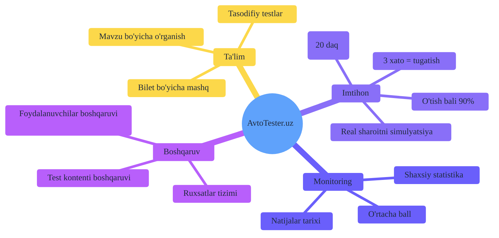
```mermaid
%%{init: {'theme': 'base', 'themeVariables': {'background': '#ffffff', 'primaryColor': '#dbeafe', 'primaryTextColor': '#1e293b', 'primaryBorderColor': '#93c5fd', 'lineColor': '#64748b', 'secondaryColor': '#fef3c7', 'tertiaryColor': '#ede9fe', 'fontFamily': 'sans-serif'}}}%%
mindmap
  root((AvtoTester.uz))
    Ta'lim
      Mavzu bo'yicha o'rganish
      Bilet bo'yicha mashq
      Tasodifiy testlar
    Imtihon
      Real sharoitni simulyatsiya
      Vaqt cheklovi (20 daq)
      3 xato = tugatish
      O'tish bali 90%
    Monitoring
      Shaxsiy statistika
      Natijalar tarixi
      O'rtacha ball
    Boshqaruv
      Foydalanuvchilar boshqaruvi
      Test kontenti boshqaruvi
      Ruxsatlar tizimi
```

---

## 3. Foydalanuvchi turlari va rollari

### 3.1 Rollar diagrammasi

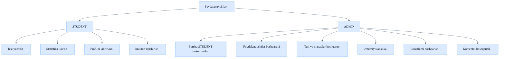
```mermaid
%%{init: {'theme': 'base', 'themeVariables': {'background': '#ffffff', 'primaryColor': '#dbeafe', 'primaryTextColor': '#1e293b', 'primaryBorderColor': '#93c5fd', 'lineColor': '#64748b', 'secondaryColor': '#fef3c7', 'tertiaryColor': '#ede9fe', 'fontFamily': 'sans-serif'}}}%%
graph TD
    A[Foydalanuvchilar] --> B[STUDENT]
    A --> C[ADMIN]
    
    B --> B1[Test yechish]
    B --> B2[Statistika ko'rish]
    B --> B3[Profilni tahrirlash]
    B --> B4[Imtihon topshirish]
    
    C --> C1[Barcha STUDENT imkoniyatlari]
    C --> C2[Foydalanuvchilar boshqaruvi]
    C --> C3[Test va mavzular boshqaruvi]
    C --> C4[Umumiy statistika]
    C --> C5[Ruxsatlarni boshqarish]
    C --> C6[Kontentni boshqarish]
```

### 3.2 Rollar tavsifi

| Rol | Enum | Tavsif | Ruxsatlar |
|-----|------|--------|-----------|
| **Talaba** | `STUDENT` | Oddiy foydalanuvchi | Test yechish, statistika ko'rish, profil tahrirlash |
| **Admin** | `ADMIN` | Tizim boshqaruvchisi | Barcha CRUD operatsiyalari, foydalanuvchi boshqaruvi |

### 3.3 Maxsus ruxsatlar

| Ruxsat | Maydon | Tavsif |
|--------|--------|--------|
| **Imtihon ruxsati** | `ruxsat` (boolean) | Admin tomonidan beriladi. `False` bo'lsa, imtihon rejimiga kirishga ruxsat yo'q |
| **Staff holati** | `is_staff` (boolean) | Django admin paneliga kirish huquqi |

---

## 4. Tizim arxitekturasi

### 4.1 Umumiy arxitektura diagrammasi

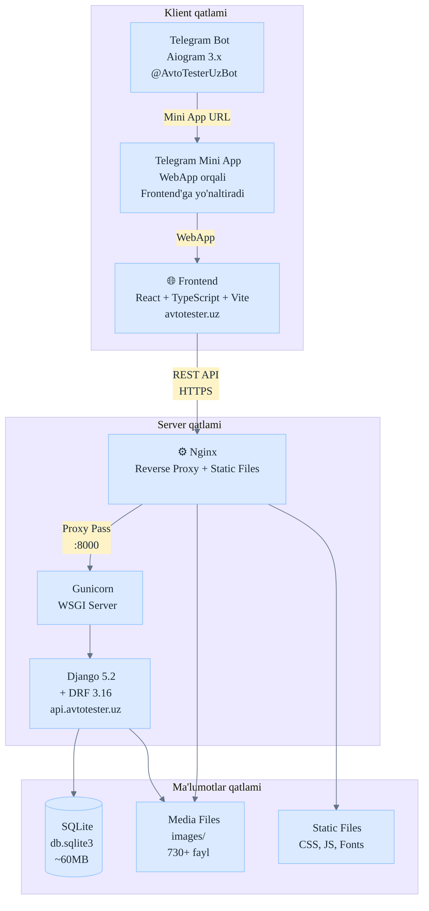
```mermaid
%%{init: {'theme': 'base', 'themeVariables': {'background': '#ffffff', 'primaryColor': '#dbeafe', 'primaryTextColor': '#1e293b', 'primaryBorderColor': '#93c5fd', 'lineColor': '#64748b', 'secondaryColor': '#fef3c7', 'tertiaryColor': '#ede9fe', 'fontFamily': 'sans-serif'}}}%%
graph TB
    subgraph "Klient qatlami"
        FE["🌐 Frontend<br/>React + TypeScript + Vite<br/>avtotester.uz"]
        TG["🤖 Telegram Bot<br/>Aiogram 3.x<br/>@AvtoTesterUzBot"]
        MA["📱 Telegram Mini App<br/>WebApp orqali<br/>Frontend'ga yo'naltiradi"]
    end

    subgraph "Server qatlami"
        NG["⚙️ Nginx<br/>Reverse Proxy + Static Files"]
        GU["🦄 Gunicorn<br/>WSGI Server"]
        DJ["🐍 Django 5.2<br/>+ DRF 3.16<br/>api.avtotester.uz"]
    end

    subgraph "Ma'lumotlar qatlami"
        DB[("💾 SQLite<br/>db.sqlite3<br/>~60MB")]
        FS["📁 Media Files<br/>images/<br/>730+ fayl"]
        ST["📂 Static Files<br/>CSS, JS, Fonts"]
    end

    FE -->|"REST API<br/>HTTPS"| NG
    TG -->|"Mini App URL"| MA
    MA -->|"WebApp"| FE
    NG -->|"Proxy Pass<br/>:8000"| GU
    GU --> DJ
    DJ --> DB
    DJ --> FS
    NG --> ST
    NG --> FS
```

### 4.2 So'rov oqimi (Request Flow)

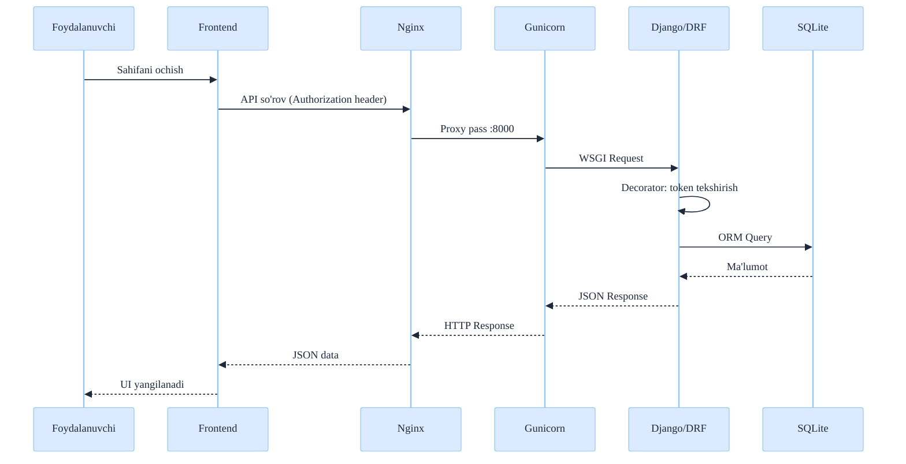
```mermaid
%%{init: {'theme': 'base', 'themeVariables': {'background': '#ffffff', 'primaryColor': '#dbeafe', 'primaryTextColor': '#1e293b', 'primaryBorderColor': '#93c5fd', 'lineColor': '#64748b', 'secondaryColor': '#fef3c7', 'tertiaryColor': '#ede9fe', 'fontFamily': 'sans-serif'}}}%%
sequenceDiagram
    participant U as Foydalanuvchi
    participant F as Frontend
    participant N as Nginx
    participant G as Gunicorn
    participant D as Django/DRF
    participant DB as SQLite

    U->>F: Sahifani ochish
    F->>N: API so'rov (Authorization header)
    N->>G: Proxy pass :8000
    G->>D: WSGI Request
    D->>D: Decorator: token tekshirish
    D->>DB: ORM Query
    DB-->>D: Ma'lumot
    D-->>G: JSON Response
    G-->>N: HTTP Response
    N-->>F: JSON data
    F-->>U: UI yangilanadi
```

---

## 5. Ma'lumotlar bazasi modeli

### 5.1 ER Diagramma (Entity-Relationship)

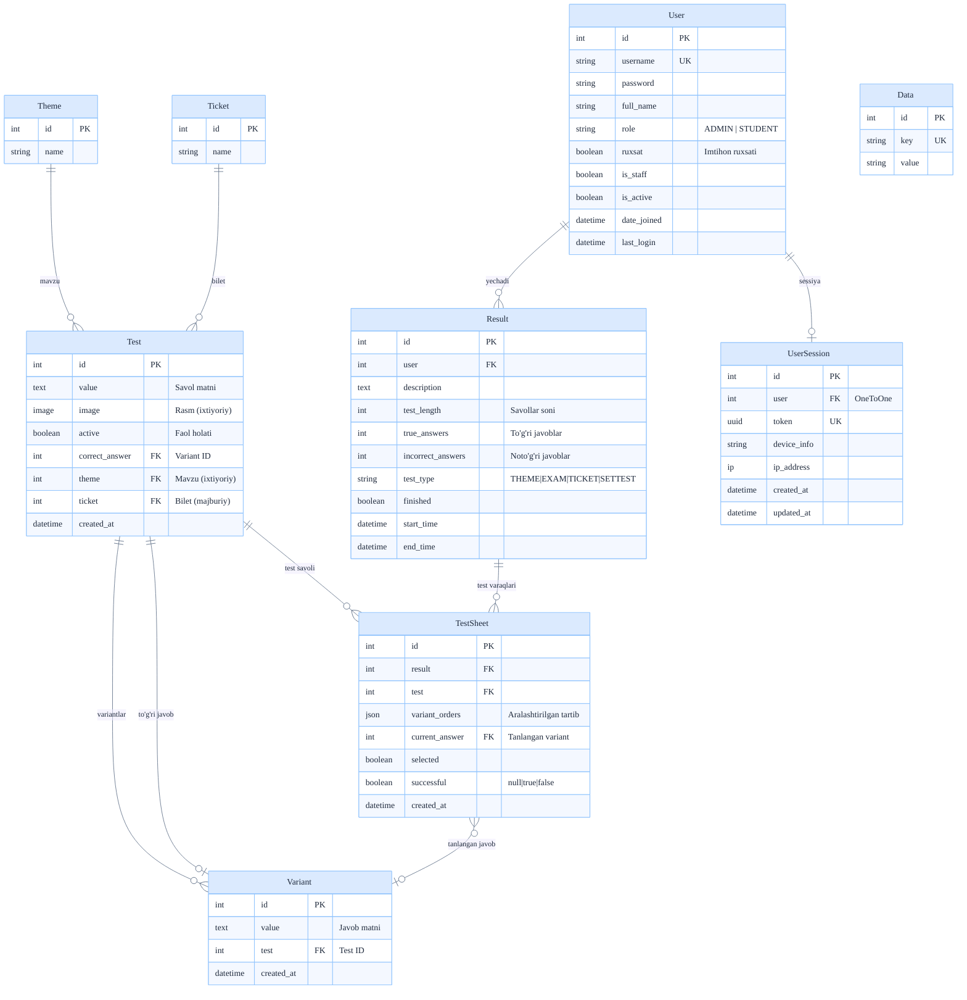
```mermaid
%%{init: {'theme': 'base', 'themeVariables': {'background': '#ffffff', 'primaryColor': '#dbeafe', 'primaryTextColor': '#1e293b', 'primaryBorderColor': '#93c5fd', 'lineColor': '#64748b', 'secondaryColor': '#fef3c7', 'tertiaryColor': '#ede9fe', 'fontFamily': 'sans-serif'}}}%%
erDiagram
    User ||--o{ Result : "yechadi"
    User ||--o| UserSession : "sessiya"
    Theme ||--o{ Test : "mavzu"
    Ticket ||--o{ Test : "bilet"
    Test ||--o{ Variant : "variantlar"
    Test ||--o| Variant : "to'g'ri javob"
    Result ||--o{ TestSheet : "test varaqlari"
    Test ||--o{ TestSheet : "test savoli"
    TestSheet }o--o| Variant : "tanlangan javob"
    
    User {
        int id PK
        string username UK
        string password
        string full_name
        string role "ADMIN | STUDENT"
        boolean ruxsat "Imtihon ruxsati"
        boolean is_staff
        boolean is_active
        datetime date_joined
        datetime last_login
    }
    
    Theme {
        int id PK
        string name
    }
    
    Ticket {
        int id PK
        string name
    }
    
    Test {
        int id PK
        text value "Savol matni"
        image image "Rasm (ixtiyoriy)"
        boolean active "Faol holati"
        int correct_answer FK "Variant ID"
        int theme FK "Mavzu (ixtiyoriy)"
        int ticket FK "Bilet (majburiy)"
        datetime created_at
    }
    
    Variant {
        int id PK
        text value "Javob matni"
        int test FK "Test ID"
        datetime created_at
    }
    
    Result {
        int id PK
        int user FK
        text description
        int test_length "Savollar soni"
        int true_answers "To'g'ri javoblar"
        int incorrect_answers "Noto'g'ri javoblar"
        string test_type "THEME|EXAM|TICKET|SETTEST"
        boolean finished
        datetime start_time
        datetime end_time
    }
    
    TestSheet {
        int id PK
        int result FK
        int test FK
        json variant_orders "Aralashtirilgan tartib"
        int current_answer FK "Tanlangan variant"
        boolean selected
        boolean successful "null|true|false"
        datetime created_at
    }
    
    UserSession {
        int id PK
        int user FK "OneToOne"
        uuid token UK
        string device_info
        ip ip_address
        datetime created_at
        datetime updated_at
    }
    
    Data {
        int id PK
        string key UK
        string value
    }
```

### 5.2 Modellar tavsifi

| Model | Fayl | Maqsad | Muhim xususiyatlari |
|-------|------|--------|---------------------|
| **User** | `models.py:8-18` | Foydalanuvchi | `AbstractUser` dan vorislik, `role` va `ruxsat` maydonlari |
| **Theme** | `models.py:20-24` | Mavzu | Test guruhlash uchun |
| **Ticket** | `models.py:26-30` | Bilet | Rasmiy biletlar bo'yicha guruhlash |
| **Test** | `models.py:32-73` | Test savoli | Rasm bilan, avtomatik eski rasm o'chirish, `correct_answer` bo'lmasa `active=False` |
| **Variant** | `models.py:75-81` | Javob varianti | Testga bog'liq |
| **Result** | `models.py:83-100` | Natija | Test sessiyasining umumiy natijasi |
| **TestSheet** | `models.py:102-117` | Test varaqasi | Har bir savol uchun javob holati, variant tartibini saqlash |
| **UserSession** | `models.py:119-128` | Sessiya | Token-based autentifikatsiya, qurilma ma'lumoti |
| **Data** | `models.py:131-133` | Key-Value | Dinamik sozlamalar (telegram_link, phone, instagram, youtube) |

---

## 6. Funksional talablar

### 6.1 Test turlari va qoidalari

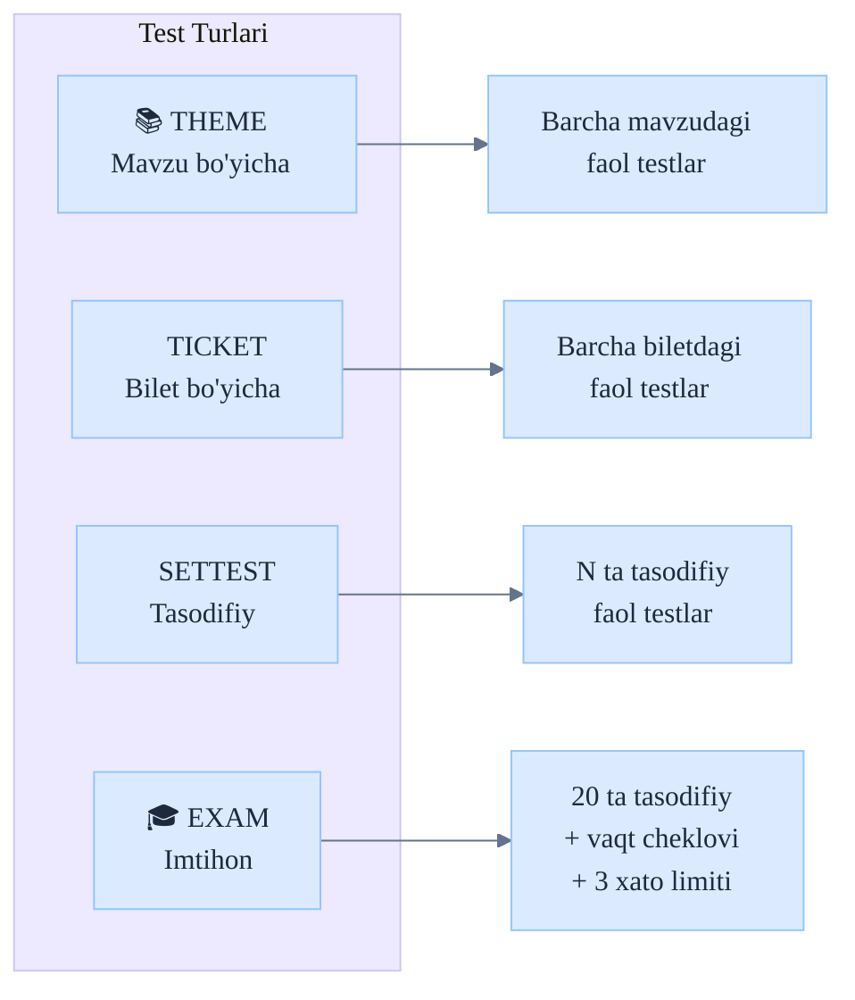
```mermaid
%%{init: {'theme': 'base', 'themeVariables': {'background': '#ffffff', 'primaryColor': '#dbeafe', 'primaryTextColor': '#1e293b', 'primaryBorderColor': '#93c5fd', 'lineColor': '#64748b', 'secondaryColor': '#fef3c7', 'tertiaryColor': '#ede9fe', 'fontFamily': 'sans-serif'}}}%%
graph LR
    subgraph "Test Turlari"
        T1["📚 THEME<br/>Mavzu bo'yicha"]
        T2["🎫 TICKET<br/>Bilet bo'yicha"]
        T3["📝 SETTEST<br/>Tasodifiy"]
        T4["🎓 EXAM<br/>Imtihon"]
    end

    T1 --> R1["Barcha mavzudagi<br/>faol testlar"]
    T2 --> R2["Barcha biletdagi<br/>faol testlar"]
    T3 --> R3["N ta tasodifiy<br/>faol testlar"]
    T4 --> R4["20 ta tasodifiy<br/>+ vaqt cheklovi<br/>+ 3 xato limiti"]
```

### 6.2 Imtihon qoidalari

| Parametr | Qiymat | Tavsif |
|----------|--------|--------|
| ⏱️ Vaqt | 20 daqiqa | Vaqt tugagandan keyin avtomatik tugatiladi |
| 📋 Savollar | 20 ta | Tasodifiy tanlangan faol testlar |
| ✅ O'tish bali | 18/20 (90%) | Muvaffaqiyatli topshirish uchun |
| ❌ Xato limiti | 3 ta | 3 ta xatodan keyin imtihon avtomatik tugatiladi |
| 🔐 Ruxsat | `ruxsat=True` | Admin tomonidan ruxsat berilishi kerak |

### 6.3 Use Case diagrammasi

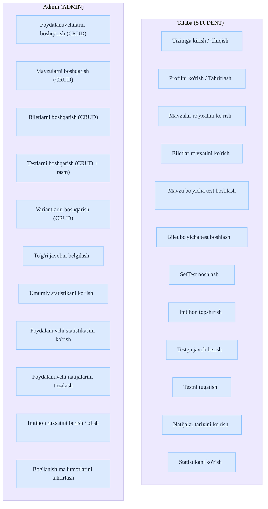
```mermaid
%%{init: {'theme': 'base', 'themeVariables': {'background': '#ffffff', 'primaryColor': '#dbeafe', 'primaryTextColor': '#1e293b', 'primaryBorderColor': '#93c5fd', 'lineColor': '#64748b', 'secondaryColor': '#fef3c7', 'tertiaryColor': '#ede9fe', 'fontFamily': 'sans-serif'}}}%%
graph TB
    subgraph "Talaba (STUDENT)"
        UC1["Tizimga kirish / Chiqish"]
        UC2["Profilni ko'rish / Tahrirlash"]
        UC3["Mavzular ro'yxatini ko'rish"]
        UC4["Biletlar ro'yxatini ko'rish"]
        UC5["Mavzu bo'yicha test boshlash"]
        UC6["Bilet bo'yicha test boshlash"]
        UC7["SetTest boshlash"]
        UC8["Imtihon topshirish"]
        UC9["Testga javob berish"]
        UC10["Testni tugatish"]
        UC11["Natijalar tarixini ko'rish"]
        UC12["Statistikani ko'rish"]
    end

    subgraph "Admin (ADMIN)"
        UC20["Foydalanuvchilarni boshqarish (CRUD)"]
        UC21["Mavzularni boshqarish (CRUD)"]
        UC22["Biletlarni boshqarish (CRUD)"]
        UC23["Testlarni boshqarish (CRUD + rasm)"]
        UC24["Variantlarni boshqarish (CRUD)"]
        UC25["To'g'ri javobni belgilash"]
        UC26["Umumiy statistikani ko'rish"]
        UC27["Foydalanuvchi statistikasini ko'rish"]
        UC28["Foydalanuvchi natijalarini tozalash"]
        UC29["Imtihon ruxsatini berish / olish"]
        UC30["Bog'lanish ma'lumotlarini tahrirlash"]
    end
```

---

## 7. API endpointlar

### 7.1 Autentifikatsiya API

| Method | Endpoint | Tavsif | Auth |
|--------|----------|--------|------|
| `POST` | `/api/auth/login/` | Tizimga kirish | ❌ |
| `POST` | `/api/auth/logout/` | Tizimdan chiqish | ✅ User |

### 7.2 Foydalanuvchi API

| Method | Endpoint | Tavsif | Auth |
|--------|----------|--------|------|
| `GET` | `/api/profile/` | Profil ma'lumotlari | ✅ User |
| `PUT` | `/api/profile/` | Profilni yangilash | ✅ User |
| `GET` | `/api/themes/` | Mavzular ro'yxati | ✅ User |
| `GET` | `/api/tickets/` | Biletlar ro'yxati | ✅ User |
| `GET` | `/api/statistics/` | Shaxsiy statistika | ✅ User |
| `GET` | `/api/results/` | Natijalar tarixi | ✅ User |

### 7.3 Test boshlash API

| Method | Endpoint | Tavsif | Body |
|--------|----------|--------|------|
| `POST` | `/api/start_tests/start_theme/` | Mavzu bo'yicha | `{"theme_id": int}` |
| `POST` | `/api/start_tests/start_ticket/` | Bilet bo'yicha | `{"ticket_id": int}` |
| `POST` | `/api/start_tests/start_settest/` | SetTest | `{"count": int}` |
| `POST` | `/api/start_tests/start_exam/` | Imtihon | `{"count": 20}` |

### 7.4 Test yechish API

| Method | Endpoint | Tavsif | Body |
|--------|----------|--------|------|
| `GET` | `/api/result/{id}/tests/` | Test savollari va variantlari | — |
| `POST` | `/api/solve_tests/{id}/answer/` | Javob yuborish | `{"variant_id": int}` |
| `POST` | `/api/solve_tests/{id}/finish/` | Testni tugatish | — |
| `GET` | `/api/result/{id}/statistics/` | Natija statistikasi | — |

### 7.5 Admin API

| Method | Endpoint | Tavsif |
|--------|----------|--------|
| `GET/POST` | `/api/admin/user/` | Foydalanuvchilar CRUD |
| `GET/PUT/DELETE` | `/api/admin/user/{id}/` | Foydalanuvchi operatsiyalari |
| `GET/POST` | `/api/admin/theme/` | Mavzular CRUD |
| `GET/PUT/DELETE` | `/api/admin/theme/{id}/` | Mavzu operatsiyalari |
| `GET/POST` | `/api/admin/ticket/` | Biletlar CRUD |
| `GET/PUT/DELETE` | `/api/admin/ticket/{id}/` | Bilet operatsiyalari |
| `GET/POST` | `/api/admin/test/` | Testlar CRUD |
| `GET/PUT/DELETE/PATCH` | `/api/admin/test/{id}/` | Test operatsiyalari (PATCH = rasm yuklash) |
| `GET/POST` | `/api/admin/test/{test_id}/variant/` | Variantlar CRUD |
| `GET/PUT/DELETE` | `/api/admin/test/variant/{id}/` | Variant operatsiyalari |
| `POST` | `/api/admin/test/variant/{id}/true/` | To'g'ri javob belgilash |
| `GET` | `/api/admin/statistics/` | Admin statistika |
| `GET` | `/api/admin/all_users_stats/` | Barcha foydalanuvchilar statistikasi |
| `GET` | `/api/admin/user_statistics/{user_id}/` | Bitta foydalanuvchi statistikasi |

### 7.6 Public API

| Method | Endpoint | Tavsif | Auth |
|--------|----------|--------|------|
| `GET` | `/api/public/connection/` | Bog'lanish ma'lumotlari | ❌ |
| `PUT` | `/api/public/connection/` | Ma'lumotlarni yangilash | ✅ Admin |

### 7.7 API so'rov oqimi

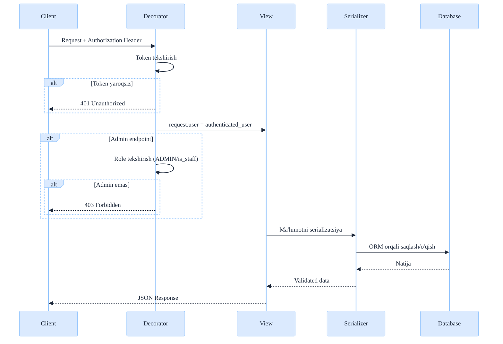
```mermaid
%%{init: {'theme': 'base', 'themeVariables': {'background': '#ffffff', 'primaryColor': '#dbeafe', 'primaryTextColor': '#1e293b', 'primaryBorderColor': '#93c5fd', 'lineColor': '#64748b', 'secondaryColor': '#fef3c7', 'tertiaryColor': '#ede9fe', 'fontFamily': 'sans-serif'}}}%%
sequenceDiagram
    participant C as Client
    participant D as Decorator
    participant V as View
    participant S as Serializer
    participant DB as Database

    C->>D: Request + Authorization Header
    D->>D: Token tekshirish
    alt Token yaroqsiz
        D-->>C: 401 Unauthorized
    end
    D->>V: request.user = authenticated_user
    alt Admin endpoint
        D->>D: Role tekshirish (ADMIN/is_staff)
        alt Admin emas
            D-->>C: 403 Forbidden
        end
    end
    V->>S: Ma'lumotni serializatsiya
    S->>DB: ORM orqali saqlash/o'qish
    DB-->>S: Natija
    S-->>V: Validated data
    V-->>C: JSON Response
```

---

## 8. Autentifikatsiya va xavfsizlik

### 8.1 Login jarayoni algoritmi

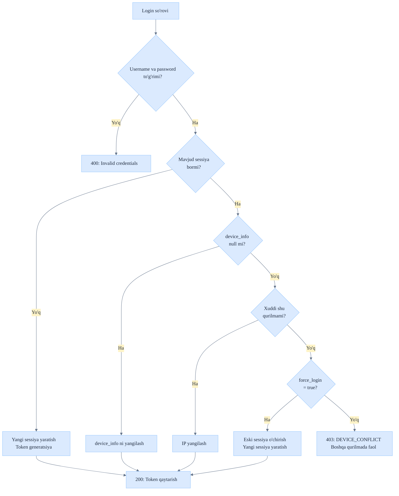
```mermaid
%%{init: {'theme': 'base', 'themeVariables': {'background': '#ffffff', 'primaryColor': '#dbeafe', 'primaryTextColor': '#1e293b', 'primaryBorderColor': '#93c5fd', 'lineColor': '#64748b', 'secondaryColor': '#fef3c7', 'tertiaryColor': '#ede9fe', 'fontFamily': 'sans-serif'}}}%%
flowchart TD
    A[Login so'rovi] --> B{Username va password<br/>to'g'rimi?}
    B -->|Yo'q| C[400: Invalid credentials]
    B -->|Ha| D{Mavjud sessiya<br/>bormi?}
    
    D -->|Yo'q| E[Yangi sessiya yaratish<br/>Token generatsiya]
    E --> F[200: Token qaytarish]
    
    D -->|Ha| G{device_info<br/>null mi?}
    G -->|Ha| H[device_info ni yangilash]
    H --> F
    
    G -->|Yo'q| I{Xuddi shu<br/>qurilmami?}
    I -->|Ha| J[IP yangilash]
    J --> F
    
    I -->|Yo'q| K{force_login<br/>= true?}
    K -->|Ha| L[Eski sessiya o'chirish<br/>Yangi sessiya yaratish]
    L --> F
    K -->|Yo'q| M[403: DEVICE_CONFLICT<br/>Boshqa qurilmada faol]
```

### 8.2 Token autentifikatsiyasi

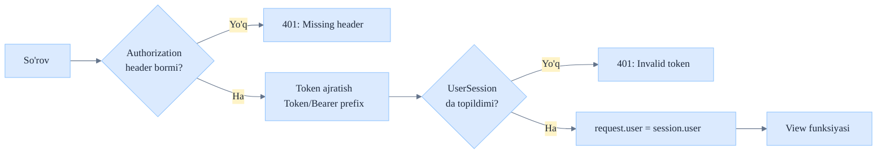
```mermaid
%%{init: {'theme': 'base', 'themeVariables': {'background': '#ffffff', 'primaryColor': '#dbeafe', 'primaryTextColor': '#1e293b', 'primaryBorderColor': '#93c5fd', 'lineColor': '#64748b', 'secondaryColor': '#fef3c7', 'tertiaryColor': '#ede9fe', 'fontFamily': 'sans-serif'}}}%%
flowchart LR
    A[So'rov] --> B{Authorization<br/>header bormi?}
    B -->|Yo'q| C[401: Missing header]
    B -->|Ha| D[Token ajratish<br/>Token/Bearer prefix]
    D --> E{UserSession<br/>da topildimi?}
    E -->|Yo'q| F[401: Invalid token]
    E -->|Ha| G[request.user = session.user]
    G --> H[View funksiyasi]
```

### 8.3 Xavfsizlik choralari

| Chora | Amalga oshirilgan | Tavsif |
|-------|-------------------|--------|
| CORS | ✅ | Faqat ruxsat berilgan domenlar |
| CSRF | ✅ | Trusted origins ro'yxati |
| Token Auth | ✅ | UUID-based custom tokenlar |
| Device Check | ✅ | Bitta qurilmadan kirish cheklovi |
| Admin Decorator | ✅ | Role-based kirish nazorati |
| Password Hashing | ✅ | Django `set_password()` |
| File Validation | ✅ | Rasm hajmi (5MB) va format tekshirish |

---

## 9. Algoritmlar va biznes logikasi

### 9.1 Test boshlash algoritmi

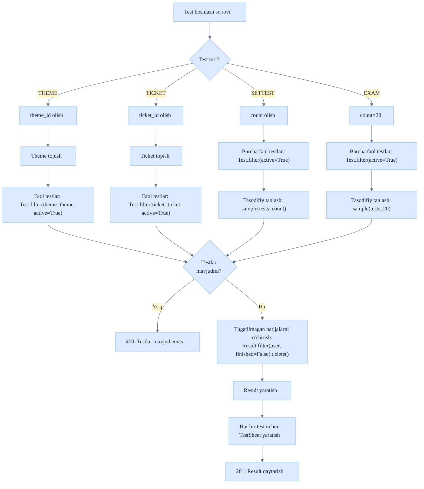
```mermaid
%%{init: {'theme': 'base', 'themeVariables': {'background': '#ffffff', 'primaryColor': '#dbeafe', 'primaryTextColor': '#1e293b', 'primaryBorderColor': '#93c5fd', 'lineColor': '#64748b', 'secondaryColor': '#fef3c7', 'tertiaryColor': '#ede9fe', 'fontFamily': 'sans-serif'}}}%%
flowchart TD
    A[Test boshlash so'rovi] --> B{Test turi?}
    
    B -->|THEME| C[theme_id olish]
    C --> D[Theme topish]
    D --> E["Faol testlar: Test.filter(theme=theme, active=True)"]
    
    B -->|TICKET| F[ticket_id olish]
    F --> G[Ticket topish]
    G --> H["Faol testlar: Test.filter(ticket=ticket, active=True)"]
    
    B -->|SETTEST| I[count olish]
    I --> J["Barcha faol testlar: Test.filter(active=True)"]
    J --> K["Tasodifiy tanlash: sample(tests, count)"]
    
    B -->|EXAM| L[count=20]
    L --> M["Barcha faol testlar: Test.filter(active=True)"]
    M --> N["Tasodifiy tanlash: sample(tests, 20)"]
    
    E --> O{Testlar<br/>mavjudmi?}
    H --> O
    K --> O
    N --> O
    
    O -->|Yo'q| P[400: Testlar mavjud emas]
    O -->|Ha| Q["Tugatilmagan natijalarni o'chirish:<br/>Result.filter(user, finished=False).delete()"]
    Q --> R[Result yaratish]
    R --> S["Har bir test uchun<br/>TestSheet yaratish"]
    S --> T[201: Result qaytarish]
```

### 9.2 Javob berish algoritmi

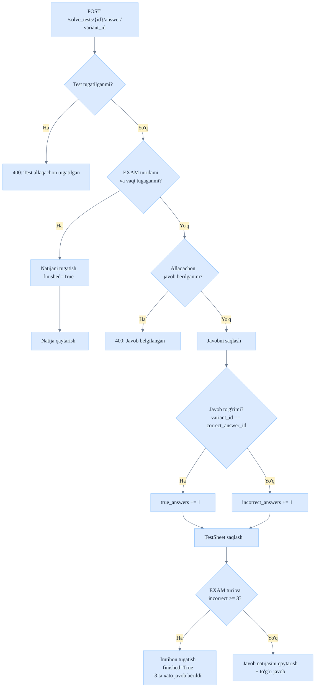
```mermaid
%%{init: {'theme': 'base', 'themeVariables': {'background': '#ffffff', 'primaryColor': '#dbeafe', 'primaryTextColor': '#1e293b', 'primaryBorderColor': '#93c5fd', 'lineColor': '#64748b', 'secondaryColor': '#fef3c7', 'tertiaryColor': '#ede9fe', 'fontFamily': 'sans-serif'}}}%%
flowchart TD
    A["POST /solve_tests/{id}/answer/<br/>variant_id"] --> B{Test tugatilganmi?}
    B -->|Ha| C[400: Test allaqachon tugatilgan]
    
    B -->|Yo'q| D{EXAM turidami<br/>va vaqt tugaganmi?}
    D -->|Ha| E[Natijani tugatish<br/>finished=True]
    E --> F[Natija qaytarish]
    
    D -->|Yo'q| G{Allaqachon<br/>javob berilganmi?}
    G -->|Ha| H[400: Javob belgilangan]
    
    G -->|Yo'q| I[Javobni saqlash]
    I --> J{Javob to'g'rimi?<br/>variant_id == correct_answer_id}
    
    J -->|Ha| K[true_answers += 1]
    J -->|Yo'q| L[incorrect_answers += 1]
    
    K --> M[TestSheet saqlash]
    L --> M
    
    M --> N{EXAM turi va<br/>incorrect >= 3?}
    N -->|Ha| O["Imtihon tugatish<br/>finished=True<br/>'3 ta xato javob berildi'"]
    N -->|Yo'q| P[Javob natijasini qaytarish<br/>+ to'g'ri javob]
```

### 9.3 Test yaratish algoritmi (Admin)

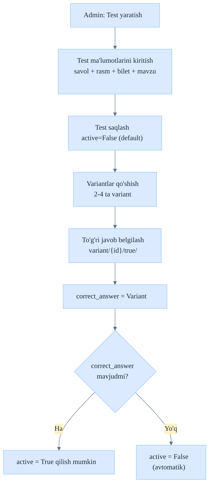
```mermaid
%%{init: {'theme': 'base', 'themeVariables': {'background': '#ffffff', 'primaryColor': '#dbeafe', 'primaryTextColor': '#1e293b', 'primaryBorderColor': '#93c5fd', 'lineColor': '#64748b', 'secondaryColor': '#fef3c7', 'tertiaryColor': '#ede9fe', 'fontFamily': 'sans-serif'}}}%%
flowchart TD
    A[Admin: Test yaratish] --> B[Test ma'lumotlarini kiritish<br/>savol + rasm + bilet + mavzu]
    B --> C["Test saqlash<br/>active=False (default)"]
    C --> D[Variantlar qo'shish<br/>2-4 ta variant]
    D --> E["To'g'ri javob belgilash<br/>variant/{id}/true/"]
    E --> F["correct_answer = Variant"]
    F --> G{correct_answer<br/>mavjudmi?}
    G -->|Ha| H[active = True qilish mumkin]
    G -->|Yo'q| I["active = False<br/>(avtomatik)"]
```

### 9.4 Test holatlarining hayot sikli

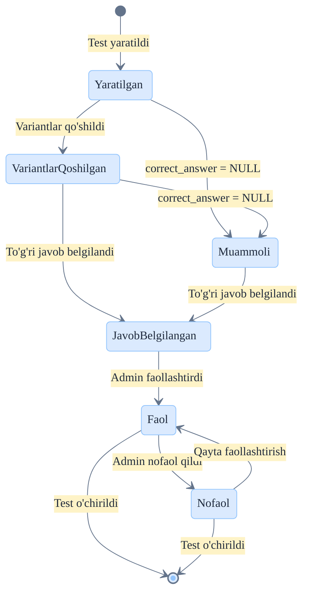
```mermaid
%%{init: {'theme': 'base', 'themeVariables': {'background': '#ffffff', 'primaryColor': '#dbeafe', 'primaryTextColor': '#1e293b', 'primaryBorderColor': '#93c5fd', 'lineColor': '#64748b', 'secondaryColor': '#fef3c7', 'tertiaryColor': '#ede9fe', 'fontFamily': 'sans-serif'}}}%%
stateDiagram-v2
    [*] --> Yaratilgan: Test yaratildi
    Yaratilgan --> VariantlarQoshilgan: Variantlar qo'shildi
    VariantlarQoshilgan --> JavobBelgilangan: To'g'ri javob belgilandi
    JavobBelgilangan --> Faol: Admin faollashtirdi
    Faol --> Nofaol: Admin nofaol qildi
    Nofaol --> Faol: Qayta faollashtirish
    
    Yaratilgan --> Muammoli: correct_answer = NULL
    VariantlarQoshilgan --> Muammoli: correct_answer = NULL
    Muammoli --> JavobBelgilangan: To'g'ri javob belgilandi
    
    Faol --> [*]: Test o'chirildi
    Nofaol --> [*]: Test o'chirildi
```

### 9.5 Imtihon natijasi hisoblash

```
Pseudocode:

FUNCTION calculate_exam_result(result):
    all = result.test_length           // Jami savollar (20)
    trues = result.true_answers        // To'g'ri javoblar
    falses = result.incorrect_answers  // Noto'g'ri javoblar
    ignores = all - trues - falses     // Javob berilmagan
    percentage = (trues / all) * 100   // Foiz
    
    IF trues >= 18:
        status = "MUVAFFAQIYATLI" ✅
    ELSE:
        status = "MUVAFFAQIYATSIZ" ❌
    
    RETURN {all, trues, falses, ignores, percentage, status}
```

---

## 10. Frontend sahifalar

### 10.1 Sahifalar xaritasi

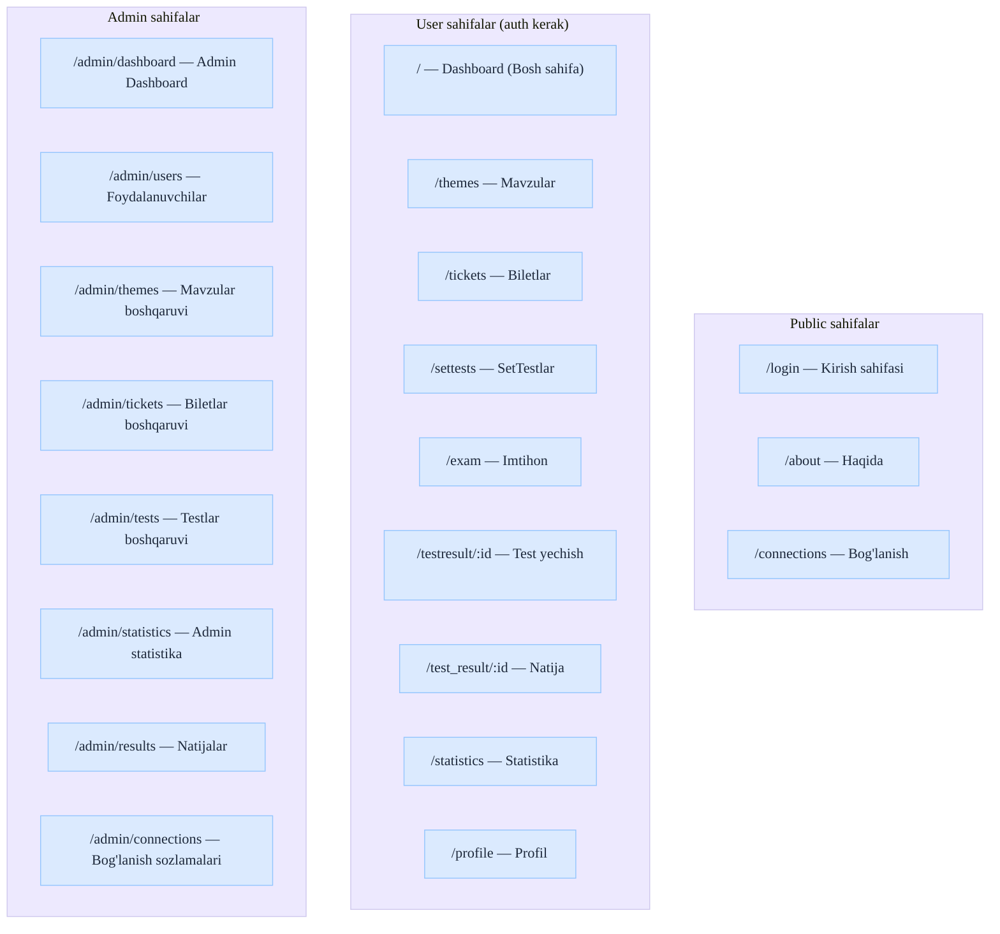
```mermaid
%%{init: {'theme': 'base', 'themeVariables': {'background': '#ffffff', 'primaryColor': '#dbeafe', 'primaryTextColor': '#1e293b', 'primaryBorderColor': '#93c5fd', 'lineColor': '#64748b', 'secondaryColor': '#fef3c7', 'tertiaryColor': '#ede9fe', 'fontFamily': 'sans-serif'}}}%%
graph TB
    subgraph "Public sahifalar"
        P1["/login — Kirish sahifasi"]
        P2["/about — Haqida"]
        P3["/connections — Bog'lanish"]
    end

    subgraph "User sahifalar (auth kerak)"
        U1["/ — Dashboard (Bosh sahifa)"]
        U2["/themes — Mavzular"]
        U3["/tickets — Biletlar"]
        U4["/settests — SetTestlar"]
        U5["/exam — Imtihon"]
        U6["/testresult/:id — Test yechish"]
        U7["/test_result/:id — Natija"]
        U8["/statistics — Statistika"]
        U9["/profile — Profil"]
    end

    subgraph "Admin sahifalar"
        A1["/admin/dashboard — Admin Dashboard"]
        A2["/admin/users — Foydalanuvchilar"]
        A3["/admin/themes — Mavzular boshqaruvi"]
        A4["/admin/tickets — Biletlar boshqaruvi"]
        A5["/admin/tests — Testlar boshqaruvi"]
        A6["/admin/statistics — Admin statistika"]
        A7["/admin/results — Natijalar"]
        A8["/admin/connections — Bog'lanish sozlamalari"]
    end
```

### 10.2 Frontend komponentlari

| Komponent | Fayl | Maqsad |
|-----------|------|--------|
| **Layout** | `components/Layout/` | Header, Footer, umumiy tuzilma |
| **AppRoutes** | `routes/AppRoutes.tsx` | Routing va auth himoyasi |
| **Backend** | `utils/Backend.tsx` | `ServerConnection` class — API aloqasi |
| **Admin** | `utils/Admin.tsx` | Admin API yordamchi funksiyalari |
| **latinToCyrillic** | `utils/latinToCyrillic.tsx` | Lotin-kirill konvertatsiya |

### 10.3 Frontend arxitektura diagrammasi

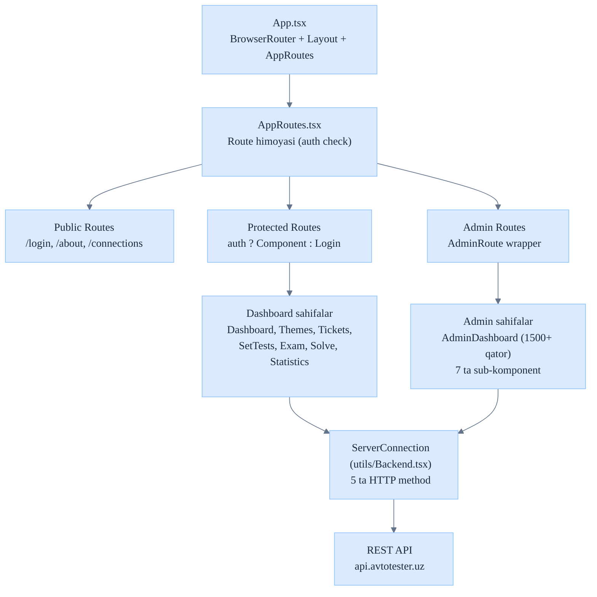
```mermaid
%%{init: {'theme': 'base', 'themeVariables': {'background': '#ffffff', 'primaryColor': '#dbeafe', 'primaryTextColor': '#1e293b', 'primaryBorderColor': '#93c5fd', 'lineColor': '#64748b', 'secondaryColor': '#fef3c7', 'tertiaryColor': '#ede9fe', 'fontFamily': 'sans-serif'}}}%%
graph TB
    App["App.tsx<br/>BrowserRouter + Layout + AppRoutes"]
    
    App --> Routes["AppRoutes.tsx<br/>Route himoyasi (auth check)"]
    
    Routes --> Public["Public Routes<br/>/login, /about, /connections"]
    Routes --> Protected["Protected Routes<br/>auth ? Component : Login"]
    Routes --> Admin["Admin Routes<br/>AdminRoute wrapper"]
    
    Protected --> Pages["Dashboard sahifalar<br/>Dashboard, Themes, Tickets,<br/>SetTests, Exam, Solve, Statistics"]
    Admin --> AdminPages["Admin sahifalar<br/>AdminDashboard (1500+ qator)<br/>7 ta sub-komponent"]
    
    Pages --> ServerConn["ServerConnection<br/>(utils/Backend.tsx)<br/>5 ta HTTP method"]
    AdminPages --> ServerConn
    
    ServerConn --> API["REST API<br/>api.avtotester.uz"]
```

---

## 11. Admin panel

### 11.1 Admin panel tuzilishi

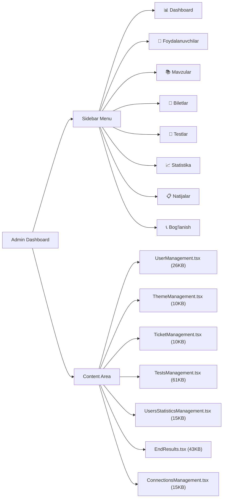
```mermaid
graph LR
    AD["Admin Dashboard"] --> S["Sidebar Menu"]
    AD --> C["Content Area"]
    
    S --> S1["📊 Dashboard"]
    S --> S2["👥 Foydalanuvchilar"]
    S --> S3["📚 Mavzular"]
    S --> S4["🎫 Biletlar"]
    S --> S5["📝 Testlar"]
    S --> S6["📈 Statistika"]
    S --> S7["📋 Natijalar"]
    S --> S8["📞 Bog'lanish"]
    
    C --> C1["UserManagement.tsx (26KB)"]
    C --> C2["ThemeManagement.tsx (10KB)"]
    C --> C3["TicketManagement.tsx (10KB)"]
    C --> C4["TestsManagement.tsx (61KB)"]
    C --> C5["UsersStatisticsManagement.tsx (15KB)"]
    C --> C6["EndResults.tsx (43KB)"]
    C --> C7["ConnectionsManagement.tsx (15KB)"]
```

### 11.2 Admin CRUD operatsiyalari

| Bo'lim | Create | Read | Update | Delete | Qo'shimcha |
|--------|--------|------|--------|--------|------------|
| **Users** | ✅ | ✅ | ✅ | ✅ | Role/Ruxsat o'zgartirish, natijalarni tozalash |
| **Themes** | ✅ | ✅ | ✅ | ✅ | — |
| **Tickets** | ✅ | ✅ | ✅ | ✅ | — |
| **Tests** | ✅ | ✅ | ✅ | ✅ | Rasm yuklash (PATCH), faollashtirish |
| **Variants** | ✅ | ✅ | ✅ | ✅ | To'g'ri javob belgilash |
| **Connections** | — | ✅ | ✅ | — | Key-value sozlamalar |

---

## 12. Telegram Bot

### 12.1 Bot arxitekturasi

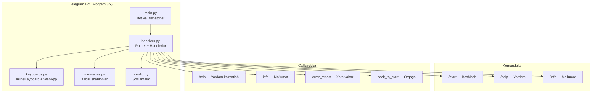
```mermaid
graph TB
    subgraph "Telegram Bot (Aiogram 3.x)"
        M["main.py<br/>Bot va Dispatcher"]
        H["handlers.py<br/>Router + Handlerlar"]
        K["keyboards.py<br/>InlineKeyboard + WebApp"]
        MSG["messages.py<br/>Xabar shablonlari"]
        CFG["config.py<br/>Sozlamalar"]
    end
    
    M --> H
    H --> K
    H --> MSG
    H --> CFG
    
    subgraph "Komandalar"
        C1["/start — Boshlash"]
        C2["/help — Yordam"]
        C3["/info — Ma'lumot"]
    end
    
    subgraph "Callback'lar"
        CB1["help — Yordam ko'rsatish"]
        CB2["info — Ma'lumot"]
        CB3["error_report — Xato xabar"]
        CB4["back_to_start — Orqaga"]
    end
    
    H --> C1
    H --> C2
    H --> C3
    H --> CB1
    H --> CB2
    H --> CB3
    H --> CB4
```

### 12.2 Bot xabar boshqaruvi

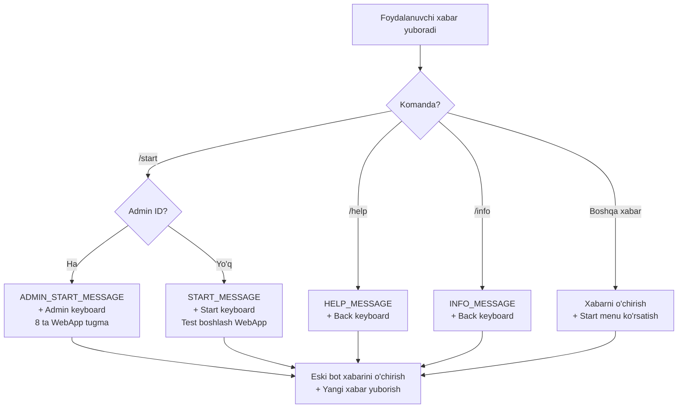
```mermaid
flowchart TD
    A[Foydalanuvchi xabar yuboradi] --> B{Komanda?}
    
    B -->|/start| C{Admin ID?}
    C -->|Ha| D[ADMIN_START_MESSAGE<br/>+ Admin keyboard<br/>8 ta WebApp tugma]
    C -->|Yo'q| E[START_MESSAGE<br/>+ Start keyboard<br/>Test boshlash WebApp]
    
    B -->|/help| F[HELP_MESSAGE<br/>+ Back keyboard]
    B -->|/info| G[INFO_MESSAGE<br/>+ Back keyboard]
    B -->|Boshqa xabar| H[Xabarni o'chirish<br/>+ Start menu ko'rsatish]
    
    D --> I[Eski bot xabarini o'chirish<br/>+ Yangi xabar yuborish]
    E --> I
    F --> I
    G --> I
    H --> I
```

### 12.3 Bot konfiguratsiyasi

| Parametr | Qiymat | Tavsif |
|----------|--------|--------|
| `BOT_TOKEN` | `.env` dan | Telegram bot tokeni |
| `MINI_APP_URL` | `https://t.me/avtotesteruzbot/app` | Mini App havolasi |
| `FRONTEND_URL` | `https://avtotester.uz` | WebApp URL |
| `ADMIN_IDS` | `[7000454062]` | Admin Telegram ID'lari |
| Versiya | 3.2.0 | Bot versiyasi |

---

## 13. Deployment arxitekturasi

### 13.1 Server konfiguratsiyasi

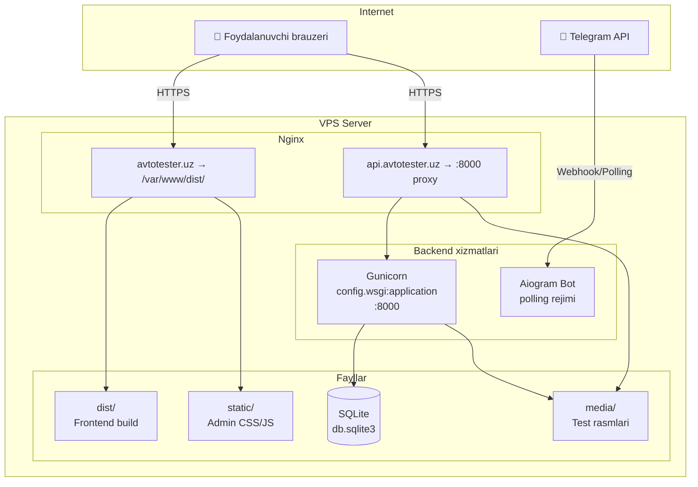
```mermaid
graph TB
    subgraph "Internet"
        CL["👤 Foydalanuvchi brauzeri"]
        TG["🤖 Telegram API"]
    end

    subgraph "VPS Server"
        subgraph "Nginx"
            N1["avtotester.uz → /var/www/dist/"]
            N2["api.avtotester.uz → :8000 proxy"]
        end
        
        subgraph "Backend xizmatlari"
            GU["Gunicorn<br/>config.wsgi:application<br/>:8000"]
            BOT["Aiogram Bot<br/>polling rejimi"]
        end
        
        subgraph "Fayllar"
            DIST["dist/<br/>Frontend build"]
            MEDIA["media/<br/>Test rasmlari"]
            DB[("SQLite<br/>db.sqlite3")]
            STATIC["static/<br/>Admin CSS/JS"]
        end
    end

    CL -->|HTTPS| N1
    CL -->|HTTPS| N2
    TG -->|Webhook/Polling| BOT
    
    N1 --> DIST
    N2 --> GU
    GU --> DB
    GU --> MEDIA
    N1 --> STATIC
    N2 --> MEDIA
```

### 13.2 Nginx konfiguratsiyasi

| Server | Port | Root/Proxy | Maqsad |
|--------|------|------------|--------|
| `avtotester.uz` | 80/443 | `/var/www/avtotester/dist` | Frontend SPA |
| `api.avtotester.uz` | 80/443 | `proxy_pass :8000` | Backend API |

### 13.3 Systemd xizmatlari

| Xizmat | Turi | Komanda | Maqsad |
|--------|------|---------|--------|
| Backend | `gunicorn` | `gunicorn config.wsgi:application -b 127.0.0.1:8000` | Django API |
| Bot | `python` | `python main.py` | Telegram bot |

---

## 14. Texnologiyalar steki

### 14.1 Backend

| Texnologiya | Versiya | Maqsad |
|-------------|---------|--------|
| Python | 3.11+ | Dasturlash tili |
| Django | 5.2.7 | Web framework |
| Django REST Framework | 3.16.1 | REST API |
| drf-spectacular | 0.29.0 | API dokumentatsiyasi (Swagger) |
| SQLite | 3.x | Ma'lumotlar bazasi |
| Pillow | 12.0.0 | Rasm ishlov berish |
| django-cors-headers | 4.9.0 | CORS sozlamalari |
| python-dotenv | 1.2.1 | Environment o'zgaruvchilari |
| Gunicorn | — | Production WSGI server |

### 14.2 Frontend

| Texnologiya | Versiya | Maqsad |
|-------------|---------|--------|
| React | 19.1.1 | UI framework |
| TypeScript | 5.9.3 | Type safety |
| Vite | 7.1.7 | Build tool va dev server |
| TailwindCSS | 4.1.16 | CSS utility framework |
| React Router | 7.9.5 | Client-side routing |
| Lucide React | 0.553.0 | Ikonkalar kutubxonasi |

### 14.3 Telegram Bot

| Texnologiya | Versiya | Maqsad |
|-------------|---------|--------|
| Aiogram | 3.x | Telegram bot framework |
| Python | 3.11+ | Dasturlash tili |

### 14.4 Infratuzilma

| Texnologiya | Maqsad |
|-------------|--------|
| Nginx | Reverse proxy, static files |
| Systemd | Service management |
| Let's Encrypt | SSL sertifikatlari |

---

## 15. Nofunksional talablar

### 15.1 Ishlash (Performance)

| Parametr | Talab |
|----------|-------|
| API javob vaqti | < 500ms |
| Sahifa yuklash | < 3 soniya |
| Fayl yuklash limiti | 50MB (DATA_UPLOAD_MAX_MEMORY_SIZE) |
| Rasm hajmi limiti | 5MB (serializer validatsiya) |
| Rasm formatlari | jpg, jpeg, png, gif, bmp, webp |

### 15.2 Xavfsizlik

| Talab | Holat |
|-------|-------|
| HTTPS | ✅ Majburiy |
| CORS himoyasi | ✅ Whitelist rejimi |
| CSRF himoyasi | ✅ Trusted origins |
| Token-based auth | ✅ UUID tokenlar |
| Parol xeshlash | ✅ Django standart |
| Role-based access | ✅ Decorator orqali |
| Input validatsiya | ✅ Serializer qatlami |

### 15.3 Moslik (Compatibility)

| Platforma | Qo'llab-quvvatlash |
|-----------|---------------------|
| Mobile browsers | ✅ Responsive dizayn |
| Desktop browsers | ✅ Chrome, Firefox, Safari, Edge |
| Telegram Mini App | ✅ WebApp orqali |
| iOS | ✅ |
| Android | ✅ |

### 15.4 Loyiha fayl tuzilishi

```
Avtotester.uz/
├── BackendAvtotester.uz/          # Backend (Django)
│   ├── api/                       # Asosiy API ilovasi
│   │   ├── models.py              # 9 ta model
│   │   ├── serializers.py         # 16+ serializer
│   │   ├── urls.py                # 30+ endpoint
│   │   ├── decorators.py          # user_required, admin_required
│   │   ├── enums.py               # RoleChoices, TestChoices
│   │   ├── admin.py               # Django admin konfiguratsiyasi
│   │   └── views/
│   │       ├── user_apis.py       # Foydalanuvchi API'lari
│   │       ├── admin_apis.py      # Admin API'lari
│   │       ├── auth_apis.py       # Login/Logout
│   │       └── public_apis.py     # Ochiq API'lar
│   ├── Bot/                       # Telegram Bot
│   │   ├── main.py                # Bot ishga tushirish
│   │   ├── handlers.py            # Komanda handlerlari
│   │   ├── keyboards.py           # Inline keyboard'lar
│   │   ├── messages.py            # Xabar shablonlari
│   │   └── config.py              # Bot sozlamalari
│   ├── config/                    # Django konfiguratsiyasi
│   │   ├── settings.py            # Asosiy sozlamalar
│   │   ├── urls.py                # Root URL'lar
│   │   └── wsgi.py                # WSGI entry point
│   ├── db.sqlite3                 # Ma'lumotlar bazasi (~60MB)
│   ├── media/                     # Yuklangan rasmlar (730+)
│   ├── requirements.txt           # Python bog'liqliklar
│   └── manage.py                  # Django CLI
│
└── FrontAvtotester.uz/            # Frontend (React)
    ├── src/
    │   ├── App.tsx                 # Root komponent
    │   ├── main.tsx                # Entry point
    │   ├── routes/
    │   │   └── AppRoutes.tsx       # Routing konfiguratsiyasi
    │   ├── components/
    │   │   └── Layout/             # Header, Footer
    │   ├── pages/
    │   │   ├── Dashboard/          # Asosiy sahifalar
    │   │   ├── Admin/              # Admin panel (80KB+ AdminDashboard)
    │   │   ├── Auth/               # Login sahifasi
    │   │   ├── Home/               # Bosh sahifa
    │   │   ├── profile/            # Profil sahifasi
    │   │   ├── About/              # Haqida
    │   │   └── Others/             # NotFound, Connections
    │   └── utils/
    │       ├── Backend.tsx         # ServerConnection class
    │       ├── Admin.tsx           # Admin API helper
    │       └── latinToCyrillic.tsx # Konvertatsiya
    ├── dist/                       # Production build
    ├── package.json                # NPM bog'liqliklar
    ├── vite.config.ts              # Vite konfiguratsiyasi
    └── index.html                  # SPA entry HTML
```

---

> **📌 Eslatma:** Ushbu BRP hujjati AvtoTester.uz loyihasining joriy holatini to'liq aks ettiradi. Loyiha ishlab chiqilayotgan bo'lgani uchun, yangi xususiyatlar qo'shilganda ushbu hujjat yangilanishi kerak.

---

*Hujjat yaratilgan sana: 2026-02-25 | Versiya: 1.0.0*
